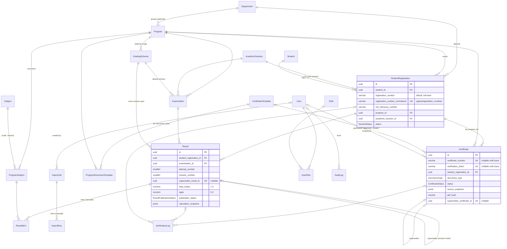

# Database

PostgreSQL 17, accessed through **Prisma 7** with the `pg` driver adapter. Everything lives in
`packages/database`.

```text
packages/database/
├── prisma/
│   ├── schema.prisma                         domain schema (models, enums, keys, indexes)
│   └── migrations/
│       ├── 20261007191730_core_academic_schema/
│       │   └── migration.sql                 generated DDL + hand-written CHECKs and triggers (frozen)
│       └── 20261008120000_student_imports/
│           └── migration.sql                 Phase 5: import job/row columns + CHECKs
├── prisma.config.ts                          schema/migrations paths, DATABASE_URL, seed command
├── src/
│   ├── client.ts                             createPrismaClient(), checkDatabaseConnection()
│   ├── seed/                                 development fixtures (+ CLI runner)
│   └── generated/prisma/                     generated client (git-ignored)
└── test/
    ├── support/                              disposable test DB, fixtures, error assertions
    └── schema/                               constraint, trigger and relationship tests
```

Related: [open client questions](./open-questions.md)

## Principles

- **One university.** No tenant or institution columns.
- **UUIDv7 primary keys**, generated by Prisma (time-ordered, so B-tree friendly). Human identifiers
  (registration number, program/subject/exam codes, certificate number) are separate columns with their
  own unique constraints. Sequential IDs are never used as public identifiers.
- **History is append-only where it matters.** Published results and issued certificates are never edited
  in place; corrections create new rows that point at what they replace.
- **One authoritative certificate record.** Certificate-number and QR-token verification both resolve to
  the `certificates` table. There is no second certificate store.
- **Rules are data.** Grading rules live in versioned `grading_schemes.rules`; nothing about a specific
  university's grading is hard-coded.
- **Restrict by default.** Academic records cannot be deleted while referenced; master data is deactivated
  (`status`) instead of deleted.
- **Database-enforced invariants.** The rules that protect academic integrity are enforced by PostgreSQL
  (constraints and triggers), not only by application code — so no script, admin tool or future bug can
  bypass them silently.

## ER diagram



Support tables without relations: `number_sequences`, `legacy_mappings`.

## Tables

| Area         | Table                             | Purpose                                                                                     |
| ------------ | --------------------------------- | ------------------------------------------------------------------------------------------- |
| Organisation | `departments`                     | Optional grouping of programs                                                               |
|              | `programs`                        | Degree/course programs (`code` unique; `level` free text until the hierarchy is confirmed)  |
|              | `academic_sessions`               | Sessions/batches (`code` unique; dates optional)                                            |
| Students     | `students`                        | A person (identity only; DOB optional and **not** a lookup factor)                          |
|              | `student_registrations`           | Enrolment of a person in a program; **registration number** is the primary human identifier |
| Curriculum   | `subjects`                        | Subject definitions, versioned by `(code, version)`                                         |
|              | `program_subjects`                | Subject placement per program **curriculum version**, with credits and marks limits         |
|              | `grading_schemes`                 | Versioned grading rules as JSON data                                                        |
| Results      | `examinations`                    | One examination of a program/session/semester                                               |
|              | `results`                         | One student's result for one attempt, as an immutable revision                              |
|              | `result_items`                    | Subject lines of a result                                                                   |
| Documents    | `certificate_templates`           | Versioned document templates                                                                |
|              | `program_document_templates`      | Which template a program uses per document type                                             |
|              | `number_sequences`                | Counters for human-readable certificate numbers                                             |
|              | `certificates`                    | **The** authoritative credential record                                                     |
| Imports      | `import_jobs`, `import_rows`      | Spreadsheet import jobs and their staged rows                                               |
| Students     | `student_profile_change_requests` | Student-submitted corrections and photos awaiting approval (Phase 7)                        |
| Access       | `users`, `roles`, `user_roles`    | Staff accounts and role records (auth itself is Phase 3)                                    |
| Logs         | `audit_logs`                      | Append-only audit trail                                                                     |
|              | `verification_logs`               | Public verification attempts (hashes only)                                                  |
| Legacy       | `legacy_mappings`                 | Legacy identifier → new record (WordPress migration, old QR URLs)                           |

### Phase 9C migration (`20261016090000_re_exam_payments`)

Additive: enums `PaymentRegion`, `PaymentDestinationStatus`, `PaymentMethod`, `PaymentEvidenceRequirement`,
`ReExamPaymentStatus`, `ReExamPaymentAmountSource`; tables `re_exam_payment_destinations` (versioned per
region; partial unique: one APPROVED per region; CHECKs: ISO currency, country only for region groups,
validity order, QR fields all-or-nothing, APPROVED needs a QR and an approver ≠ creator, only APPROVED can
be active), `re_exam_payment_destination_rates` (approved amount per attempt, integer minor units) and
`re_exam_payments` (obligation snapshot + submission + review; CHECKs tie every column group to the status
and require a verified amount/currency equal to the obligation; partial unique: one live obligation per
application, one SUBMITTED/VERIFIED payment per normalised transaction reference). Triggers:
`re_exam_payment_destinations_guard` (no deletes, DRAFT-only edits, replacement of the same region's
APPROVED version only, final decisions), `re_exam_payment_destination_rates_guard` (DRAFT only),
`re_exam_payments_guard` (created AWAITING_PAYMENT for the student's own assessed SUBMITTED/APPROVED
application at an approved, active, in-effect destination with the amount re-derived from the fee snapshot
or the destination's rate; immutable snapshot; non-editable submissions; final decisions; no deletes). No
existing table or row changes (verified on the local database after a backup).

### Phase 9B snapshot hardening (`20261015093000_re_exam_fee_snapshot_required_fields`)

An additive CHECK explicitly requires currency and amount on assessed fees. PostgreSQL CHECKs accept
NULL results, so pattern and positive-value comparisons alone cannot enforce these nullable columns.
The original applied migration is unchanged.

### Phase 9B migration (`20261015090000_re_exam_applications`)

Additive: enums `ReExamFeeScope`, `ReExamFeeRuleStatus`, `ReExamApplicationStatus`, `ReExamFeeStatus`;
tables `re_exam_fee_rules` (version, scope, ISO currency, attempt basis, lifecycle; partial unique: one
ACTIVE), `re_exam_fee_rates` (rule, attempt ≥ 1, `amount_minor` > 0 — integer minor units) and
`re_exam_applications` (student, registration, examination, curriculum line, catalogue subject,
server-derived attempt + basis, identity snapshot, decision columns, fee snapshot; partial unique: one live
application per registration + examination + subject). CHECKs keep the fee snapshot all-or-nothing and the
decision columns consistent with the status. Triggers: `re_exam_fee_rules_guard` (no deletes, DRAFT-only
edits, DRAFT→ACTIVE (needs a rate)→RETIRED), `re_exam_fee_rates_guard` (rates change only while the rule is
DRAFT), `re_exam_applications_guard` (created SUBMITTED for a registration of the student that follows the
examination's curriculum, an OPEN re-examination accepting applications and a subject of its period;
identity/attempt immutable; fee NOT_CONFIGURED → ASSESSED once while SUBMITTED; SUBMITTED → APPROVED |
REJECTED | CANCELLED once; never deleted).

### Phase 9A migration (`20261014090000_examination_portal_foundation`)

Additive: enum `ExaminationKind` (REGULAR, RE_EXAMINATION); table `external_exam_applications` (name,
https website/Android/iOS links, instructions, active flag, creator/updater) with a CHECK allowing only
`https://` URLs without credentials or whitespace; on `examinations`: nullable `curriculum_id` (composite FK
`(curriculum_id, program_id)` → `program_curricula(id, program_id)`, so the curriculum always belongs to the
examination's program), `kind` (default REGULAR) and `re_exam_applications_open` (default false; CHECK:
re-examinations only). Trigger `examinations_curriculum_guard`: a linked examination's period is within
the curriculum's periods and the curriculum is not DRAFT. Existing examination rows keep their values.

### Phase 8 hardening migration (`20261013090000_historical_document_hardening`)

Additive: enum `EmbeddedMetadataCategory` and nullable columns on `historical_documents` —
`certificate_number_normalized` (indexed; search and duplicate-warning form of the raw
`certificate_number`), `student_copy_storage_key`/`_content_type`/`_size_bytes`/`_sha256`/`_created_at`
(the metadata-free copy students receive for JPEG/PNG documents, a separate private object) and
`embedded_metadata` (kinds of metadata found in the original image — never values). Existing values are
not changed; the normalised number is filled for existing rows inside one atomic statement (the Phase 8
guard is suspended only for that derived-column fill, because SUPERSEDED rows are read-only). CHECKs:
number and normalised form exist together (no control characters, normalised form non-empty without
whitespace); the student copy is all-or-nothing, images only, same format, a different object than the
original. Trigger `historical_documents_hardening_guard`: the student copy is set once and then
immutable; an image cannot become PUBLISHED without it; the normalised number is frozen after DRAFT.

### Phase 8 migration (`20261012090000_historical_documents`)

Additive: enums `HistoricalDocumentType`, `HistoricalDocumentStatus`, `DocumentAuthenticity`,
`DocumentProvenance` and table `historical_documents` (registration, type, title, certificate number,
issue date, provenance and legacy identifiers, private file key/type/size/SHA-256/display name, uploader,
publication/withdrawal/supersession and authenticity-review columns, replacement link). Partial unique
indexes: one live copy of a file per registration; one live replacement per document. CHECKs: accepted
content types and hash format; status ⇔ decision columns (withdrawal needs a reason); authenticity
review by someone other than the uploader. Trigger `historical_documents_guard`: created as DRAFT, file
and owner immutable, metadata frozen after DRAFT, allowed transitions only, same-registration
replacements, no deletes. No existing table changes. See [ADR-0013](../decisions/ADR-0013-historical-documents.md).

### Phase 7 migration (`20261010090000_student_profile_change_requests`)

Additive: enum `ProfileChangeRequestStatus` (PENDING, APPROVED, REJECTED, CANCELLED) and table
`student_profile_change_requests` (student, submitting account, proposed changes and submission snapshot as
JSONB, note, staged photo key/hash/size/dimensions, the official photo key at submission, reviewer, decision
times, rejection reason). Partial unique index: one PENDING request per student. CHECKs tie the decision
columns to the status and require a change or a photo; trigger `profile_change_requests_guard` keeps
submissions immutable, decisions final and rows undeletable. See [ADR-0011](../decisions/ADR-0011-profile-change-requests.md).

### Phase 5 migration (`20261008120000_student_imports`)

The frozen Phase 2 migration is untouched. The new migration adds what the import worker needs to run the
persisted wizard: on `import_jobs` — progress (0–100), `active_run_id` (worker-run ownership), discovered
`sheets`, `worksheet_name`, file size and SHA-256, create/update/unchanged and created/updated counts,
`apply_updates`, a JSON `failure` (`{stage, code, message, retryable}`), the error-report key, the
committing user and timestamps; on `import_rows` — `action` (new enum `ImportRowAction`: CREATE, UPDATE,
SKIP) and `registration_id` (`ON DELETE SET NULL`). New CHECKs: non-negative counts, progress range,
SHA-256 format, `status = 'FAILED'` ⇔ failure present, `status = 'ERROR'` ⇔ no action, IMPORTED rows
reference a registration. See [imports architecture](../architecture/imports.md).

## Important constraints

**Unique keys** (in addition to every primary key):

| Table                                                          | Unique                                                                                 | Notes                                                                   |
| -------------------------------------------------------------- | -------------------------------------------------------------------------------------- | ----------------------------------------------------------------------- |
| `departments`, `programs`, `academic_sessions`, `examinations` | `code`                                                                                 | Codes are trimmed and non-empty (CHECK)                                 |
| `student_registrations`                                        | `registration_number_normalized`                                                       | `= upper(registration_number)` (CHECK), so case variants are duplicates |
| `student_registrations`                                        | `(id, program_id)`                                                                     | Target of the certificate composite FK                                  |
| `subjects`                                                     | `(code, version)`                                                                      | Same code may exist across syllabus versions                            |
| `program_subjects`                                             | `(program_id, curriculum_version, subject_id)`                                         | A subject appears once per curriculum version                           |
| `grading_schemes`                                              | `(name, version)`                                                                      |                                                                         |
| `results`                                                      | `(student_registration_id, examination_id, attempt_number, revision_number)`           |                                                                         |
| `results`                                                      | `supersedes_result_id`                                                                 | A revision is superseded at most once → linear history                  |
| `results`                                                      | partial: `(registration, examination, attempt) WHERE publication_status = 'PUBLISHED'` | One published revision per attempt                                      |
| `results`                                                      | partial: same columns `WHERE publication_status IN (DRAFT, UNDER_REVIEW, APPROVED)`    | One in-progress revision per attempt                                    |
| `result_items`                                                 | `(result_id, program_subject_id)`                                                      | One line per subject per revision                                       |
| `certificate_templates`                                        | `(name, version)`; `(id, document_type)`                                               | The second backs the mapping composite FK                               |
| `program_document_templates`                                   | partial: `(program_id, document_type) WHERE is_default`                                | One default per program and document type                               |
| `certificates`                                                 | `certificate_number`; `verification_token`; `supersedes_certificate_id`                | Unique **when present** (PostgreSQL allows many NULLs)                  |
| `number_sequences`                                             | `key`                                                                                  |                                                                         |
| `import_rows`                                                  | `(import_job_id, row_number)`                                                          |                                                                         |
| `users`                                                        | `email`                                                                                | Stored lower-case (CHECK) → case-insensitive                            |
| `roles`                                                        | `name`                                                                                 |                                                                         |
| `user_roles`                                                   | PK `(user_id, role_id)`                                                                |                                                                         |
| `legacy_mappings`                                              | `(source_system, source_entity, source_identifier)`                                    |                                                                         |

**Composite foreign keys**

- `certificates (student_registration_id, program_id) → student_registrations (id, program_id)`: a
  certificate's program is always its registration's program. `ON UPDATE RESTRICT`.
- `program_document_templates (certificate_template_id, document_type) → certificate_templates (id, document_type)`:
  a program can only map a template of the same document type. `ON UPDATE RESTRICT`.

**CHECK constraints** (26, in the migration): non-negative marks/credits/GPAs; `total ≤ max`;
`credits_earned ≤ credits_attempted`; `pass_marks ≤ max_marks`; ordered date ranges; revision 1 has no
predecessor and later revisions must have one; APPROVED/PUBLISHED results need an outcome and PUBLISHED
needs `published_at`; ISSUED/REVOKED/SUPERSEDED certificates need number, token, issue date and `issued_at`;
REVOKED needs `revoked_at` + reason; CANCELLED needs `cancelled_at` + reason; verification tokens are at
least 22 characters (≈128 bits base64url); grading `rules` is a JSON object; default template mappings are
undated and overrides are dated; import counts are non-negative; emails are lower-case.

## Database-enforced invariants (triggers)

All guards raise SQLSTATE **`DV001`** with a message prefixed by the guard name. A dedicated code keeps them
distinguishable from genuine foreign-key/unique errors (Prisma surfaces it as `P2010` with
`originalCode: "DV001"`); the API will map it to HTTP 409.

| Trigger                                            | Rule                                                                                                                                                                                                                                                                                                                                                                                                                                                                                                  |
| -------------------------------------------------- | ----------------------------------------------------------------------------------------------------------------------------------------------------------------------------------------------------------------------------------------------------------------------------------------------------------------------------------------------------------------------------------------------------------------------------------------------------------------------------------------------------- |
| `results_guard`                                    | Revision N must supersede revision N−1 of the **same** registration, examination and attempt. Identity columns never change. **PUBLISHED results are frozen**: only `PUBLISHED → SUPERSEDED/WITHHELD` and `WITHHELD → PUBLISHED/SUPERSEDED` transitions, with no other column changing. SUPERSEDED rows are fully frozen. A result can be marked SUPERSEDED only once its replacement exists. Results that were ever published cannot be deleted.                                                     |
| `result_items_guard`                               | Items can be added/changed/removed only while the result is DRAFT or UNDER_REVIEW (or WITHHELD before ever being published). Approval freezes them.                                                                                                                                                                                                                                                                                                                                                   |
| `certificates_guard`                               | Identity columns never change. A number or token, once assigned, never changes. **ISSUED certificates are frozen** except for `ISSUED → REVOKED` (with revocation fields) and `ISSUED → SUPERSEDED` (only once a replacement exists). REVOKED, SUPERSEDED and CANCELLED are fully frozen. Only DRAFT certificates can be deleted. A replacement must be for the same registration and document type and may only replace an issued or revoked certificate. The template must match the document type. |
| `certificate_templates_guard`                      | Only DRAFT templates can be edited or deleted; ACTIVE → ARCHIVED is the only other change.                                                                                                                                                                                                                                                                                                                                                                                                            |
| `grading_schemes_guard`                            | Only DRAFT schemes can be edited or deleted; ACTIVE/ARCHIVED rules are frozen (closing `effective_to` and ACTIVE → ARCHIVED are allowed).                                                                                                                                                                                                                                                                                                                                                             |
| `program_document_templates_guard`                 | Dated overrides for the same program and document type may not overlap (serialised with an advisory lock).                                                                                                                                                                                                                                                                                                                                                                                            |
| `profile_change_requests_guard`                    | Requests are created PENDING by an account of the same student; submitted data never changes; a decision (APPROVED/REJECTED/CANCELLED) happens once; requests cannot be deleted.                                                                                                                                                                                                                                                                                                                      |
| `historical_documents_guard`                       | Documents are created DRAFT; file, registration and replacement link never change; metadata changes only while DRAFT; DRAFT→PUBLISHED/WITHDRAWN, PUBLISHED→WITHDRAWN/SUPERSEDED, WITHDRAWN→PUBLISHED only; SUPERSEDED is final; replacements stay on the same registration; never deleted.                                                                                                                                                                                                            |
| `examinations_curriculum_guard`                    | An examination linked to a curriculum uses one of its periods (semester or year) and never a DRAFT curriculum version.                                                                                                                                                                                                                                                                                                                                                                                |
| `historical_documents_hardening_guard`             | The student copy of an image (key, type, size, SHA-256, time, metadata kinds) is set once and never changed; an image document cannot be published without it; the normalised certificate number changes only while DRAFT.                                                                                                                                                                                                                                                                            |
| `audit_logs_append_only`, `audit_logs_no_truncate` | Audit entries can never be updated, deleted or truncated.                                                                                                                                                                                                                                                                                                                                                                                                                                             |
| `verification_logs_append_only`                    | Verification entries can never be updated. Deletion stays possible for a future retention policy.                                                                                                                                                                                                                                                                                                                                                                                                     |

> **Operational note.** A database superuser can still disable triggers. Any future data repair or legacy
> import that needs to do so must be a reviewed, audited procedure — never an ad-hoc fix.

## Revision strategy (results)

```text
rev 1  PUBLISHED ──► SUPERSEDED (frozen forever)
                       ▲ supersedes
rev 2  DRAFT → UNDER_REVIEW → APPROVED → PUBLISHED
```

1. A correction is a **new row**: same registration, examination and attempt; `revision_number + 1`;
   `supersedes_result_id` = the published revision. The published revision stays visible and unchanged
   while the correction is prepared (one PUBLISHED and one in-progress revision may coexist).
2. Publishing the correction happens in one transaction: mark the old revision SUPERSEDED, then mark the
   new one PUBLISHED. The partial unique index guarantees there is never more than one PUBLISHED revision.
3. Each result records the exact `grading_scheme_id` (a frozen version) plus a `calculation_snapshot`, so
   published figures stay reproducible even after newer schemes exist.
4. A re-sit is a new **attempt** (`attempt_number + 1`), not a revision.

## Certificate source-of-truth rule

- `certificates` is the only table that represents an issued credential. Verification by **certificate
  number** and by **QR token** must both query it; no other table may answer "is this certificate valid?".
- `certificate_number` and `verification_token` are NULL while a certificate is a draft and are assigned at
  issue (allocation logic arrives in Phase 10). Once assigned they never change.
- What was printed is frozen in `source_snapshot` and `pdf_hash`, so later edits to the student, program or
  template can never change an issued document.
- A reissue is a new certificate that supersedes the old one. The old record — and therefore its number and
  QR token — remains resolvable and reports SUPERSEDED (or REVOKED) rather than disappearing.
- Legacy WordPress certificates will be migrated **into this table**, with `legacy_mappings` recording old
  identifiers so printed legacy QR URLs keep resolving. The legacy two-store split is never recreated.

## Delete / retention strategy

| Relationship                              | On delete    | Why                                                                                                                                                            |
| ----------------------------------------- | ------------ | -------------------------------------------------------------------------------------------------------------------------------------------------------------- |
| `result_items.result_id → results`        | **CASCADE**  | Items are part of the result aggregate. Only deletable drafts can ever be deleted (trigger), so published lines are never lost                                 |
| `import_rows.import_job_id → import_jobs` | **CASCADE**  | Rows are staging data owned by their job; deleting a job is the retention mechanism                                                                            |
| `user_roles.user_id → users`              | **CASCADE**  | A role link is meaningless without its user (users are normally disabled, not deleted)                                                                         |
| Every other foreign key                   | **RESTRICT** | Academic records, curriculum, examinations, templates, certificates, users referenced by certificates/imports/audit entries, and log targets must be preserved |

- Master data (`departments`, `programs`, `subjects`) is retired with `status = INACTIVE`, not deleted.
- Users are disabled (`status = DISABLED`), not deleted, once they have acted on records.
- Published results, issued certificates and audit entries are never deleted (triggers).
- Composite FKs use `ON UPDATE RESTRICT` so changing a registration's program or a template's type can't
  silently rewrite dependent certificates or mappings. (Other FKs reference immutable UUID primary keys.)

## Precision

| Kind                                                            | PostgreSQL type | Range           | Rationale                                                                                                                                  |
| --------------------------------------------------------------- | --------------- | --------------- | ------------------------------------------------------------------------------------------------------------------------------------------ |
| Marks (component, item total/max, result total/max, pass marks) | `NUMERIC(7,2)`  | up to 99 999.99 | Supports half/quarter marks and moderated decimals; a full semester's totals fit comfortably                                               |
| Credits (attempted/earned, curriculum, default)                 | `NUMERIC(5,2)`  | up to 999.99    | Fractional credits (1.5, 0.75)                                                                                                             |
| Grade points, SGPA, CGPA                                        | `NUMERIC(5,3)`  | up to 99.999    | 10- and 4-point scales with one digit of headroom beyond common 2-decimal reporting, so the grading rules (not the column) decide rounding |
| Sequence counters                                               | `BIGINT`        |                 |                                                                                                                                            |

Values beyond the declared precision are **rejected**, not truncated (tested). The application must round
deliberately, according to the grading rules, before storing.

## Index strategy

Every unique constraint above is also an index. Additional indexes target known query paths:

| Index                                                                                                                                        | Serves                                            |
| -------------------------------------------------------------------------------------------------------------------------------------------- | ------------------------------------------------- |
| `student_registrations (roll_reference_number)`                                                                                              | Lookup/import matching by roll number             |
| `student_registrations (program_id, academic_session_id)`, `(academic_session_id)`, `(student_id)`, `(department_id)`                        | Cohort lists, joins                               |
| `program_subjects (program_id, curriculum_version, semester_number)`                                                                         | Loading a semester's curriculum                   |
| `examinations (program_id, academic_session_id, semester_number)`, `(status)`                                                                | Exam lists and filters                            |
| `results (examination_id, publication_status)`                                                                                               | Publishing/reviewing an examination's results     |
| `certificates (student_registration_id, document_type)`, `(status)`, `(document_type, status)`                                               | Student document history, admin queues            |
| `import_jobs (type, status, created_at DESC)`                                                                                                | Import history screens                            |
| `import_rows (import_job_id, status)`                                                                                                        | Error review pages                                |
| `verification_logs (type, created_at DESC)`, `(created_at DESC)`, and per-target FKs                                                         | Verification log screens, retention               |
| `audit_logs (entity_type, entity_id, created_at DESC)`, `(action, created_at DESC)`, `(actor_user_id, created_at DESC)`, `(created_at DESC)` | Entity history, action reports, per-user activity |
| Indexes on the remaining FK columns                                                                                                          | Join performance and RESTRICT checks              |

**Deliberately deferred:** student **name search**. Admin search will likely need case- and
accent-insensitive partial matching, which needs `pg_trgm` (GIN trigram index) or full-text search. The
right choice depends on the search UI (Phase 5), so no name index is created yet rather than one that
doesn't fit the eventual query.

## Partial-index predicates and drift detection

Partial indexes use Prisma's `partialIndexes` preview feature. Predicates are written **exactly as
PostgreSQL normalises them** (`pg_get_expr`), e.g. `publication_status = ANY (ARRAY['DRAFT'::"ResultPublicationStatus", …])`
rather than `IN (…)`. Otherwise Prisma compares unequal strings and reports drift forever. CHECK
constraints, functions and triggers are invisible to Prisma's diff, so they never cause false drift.

## Workflows and commands

| Command            | Purpose                                                                                           |
| ------------------ | ------------------------------------------------------------------------------------------------- |
| `pnpm db:migrate`  | `prisma migrate dev`: apply pending migrations / create a new one (needs an interactive terminal) |
| `pnpm db:deploy`   | `prisma migrate deploy`: apply committed migrations (CI, production)                              |
| `pnpm db:check`    | Drift check: exit 0 = database matches `schema.prisma`, 2 = differs, 1 = error                    |
| `pnpm db:seed`     | Build + load **development fixtures** (refuses production and non-local hosts)                    |
| `pnpm db:generate` | Regenerate the Prisma client (Prisma 7 does not do this during `migrate dev`)                     |
| `pnpm db:status`   | `prisma migrate status`                                                                           |

After pulling new migrations: `pnpm db:deploy` (or `pnpm db:migrate`), then `pnpm db:generate`.

**Rules for schema changes:** every change is a new, reviewed migration. Never edit an applied migration.
Hand-written SQL (CHECKs, triggers) goes at the end of the migration that introduces the table, and every
invariant gets a test in `packages/database/test/schema/`.

## Tests

`pnpm --filter @docversity/database test` creates a disposable **`<db>_test`** database (it refuses any
other name, and refuses non-local hosts outside CI), applies the real migrations with
`prisma migrate deploy`, and runs the schema suites. Tests never touch development data. The trigger tests
were mutation-checked: removing `results_guard` makes 6 result tests fail.

## Development seed data

`pnpm db:seed` creates (idempotently) one department, two programs, one session, three subjects with
curriculum lines, one **placeholder** grading scheme (DRAFT, no rules), two students with registrations
`DEV-REG-0001` / `DEV-REG-0002`, and one DRAFT examination. Every name says "Development Fixture". It
creates **no results and no certificates**.

## Phase 7B curriculum versions

`ProgramCurriculum` versions existing `Program` records; `ProgramSubject` is the existing per-period
placement with a required version link. `Subject` remains the shared catalogue, and registrations have
an optional explicit version. `semester_number` is retained as the stored period number for both structures.
Existing results still reference `ProgramSubject`; no result/certificate storage is replaced.

Three append-only migrations introduce/backfill the model, add history guards, and preserve the existing
foreign-key RESTRICT behavior on referenced placement deletion. Legacy version labels become DRAFT
versions, with placements attached and ordered; no student registration is assigned by the upgrade.
Existing result rows and old placement columns remain unchanged. History guards protect catalogue
identity, result-bearing placements/drafts and result-bearing registrations, including unassigned ones.
See [ADR-0012](../decisions/ADR-0012-curriculum-versions.md) and the
[delivery report](../development/phase-7b-course-curriculum.md).

Reproduce the isolated synthetic upgrade check with
`node packages/database/scripts/verify-curriculum-upgrade.mjs` (local PostgreSQL and root `.env` required).
It creates and drops its own suffixed database and never upgrades the development database.
