# Phase 7 — Student profile change requests (delivery notes)

Branch `feature/phase-7-student-profile` (from `main` at `caf14a5`). Design: [ADR-0011](../decisions/ADR-0011-profile-change-requests.md).
API reference: [docs/api/profile-requests.md](../api/profile-requests.md).

## What students can do

- `/student/profile`: official details (read-only) plus **Update my details** — submit a missing date of
  birth, upload or replace a photo, correct full name, father's/mother's name and gender, add a note.
  Edit → **review** (on record vs proposed, photo preview) → **Submit for approval**.
- `/student/profile/requests`: every request with its status, decision time, the student's note, the
  submitted photo and — when rejected — the university's reason. Pending requests can be cancelled.
- After approval the official profile, dashboard identity card, top bar and Recent activity show the new
  values and photo. Recent activity lists only the student's own events (activation, submissions,
  decisions).

## What staff can do

- `/admin/profile-requests` (permission `studentProfileRequests.read`): search by name or registration
  number, filter by status; the pending queue is worked oldest first.
- `/admin/profile-requests/[id]`: submitted vs proposed vs current official values, "changed since
  submission" markers, current and proposed photo side by side, history (audit), other requests from the
  student; **Approve** (confirmation) and **Reject** (mandatory reason) with `studentProfileRequests.review`.
  Stale requests cannot be approved.

## Screenshots (synthetic E2E data)

| Desktop                                                                      | Mobile (390 px)                                                  |
| ---------------------------------------------------------------------------- | ---------------------------------------------------------------- |
| 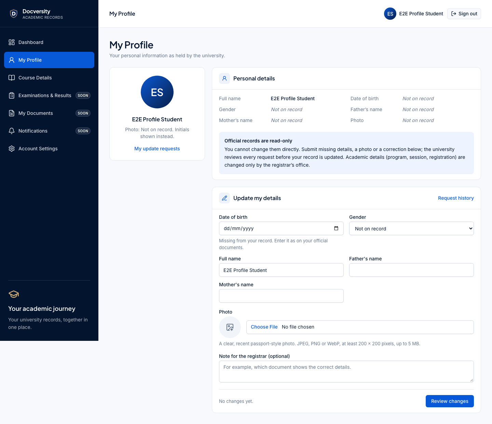                    | 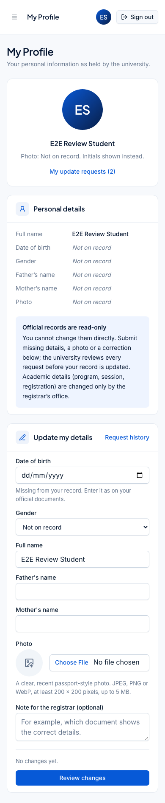         |
| 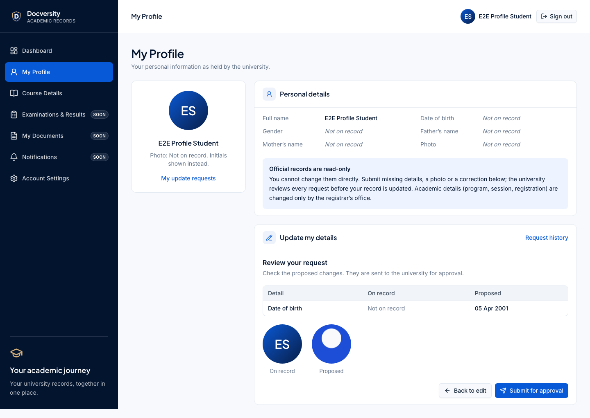                   | 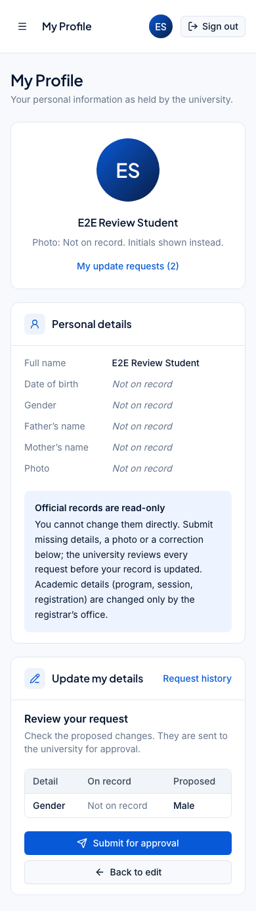        |
| 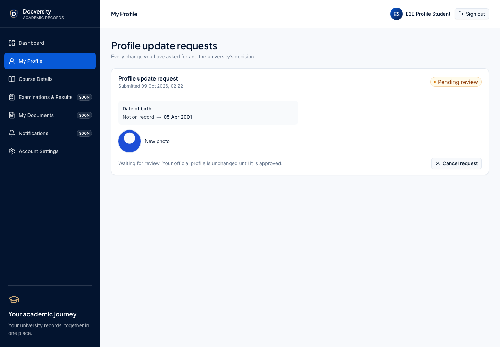     | 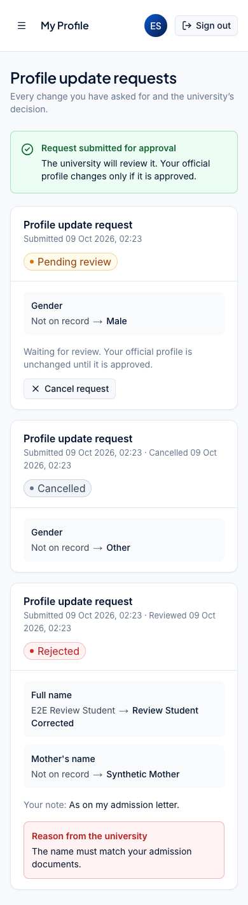         |
| 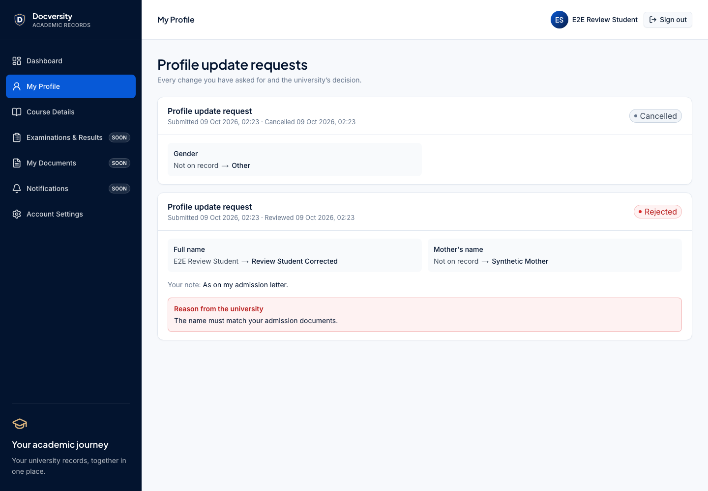     | 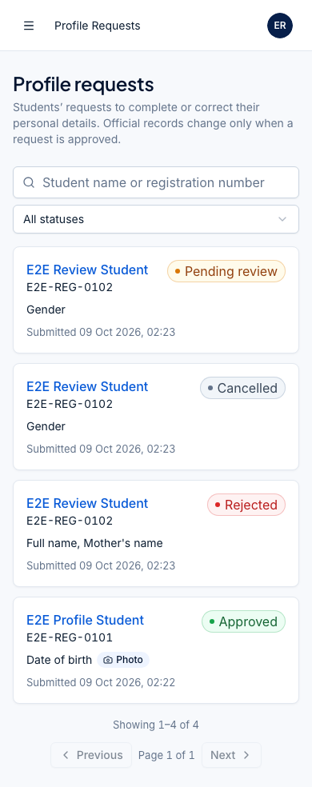        |
| 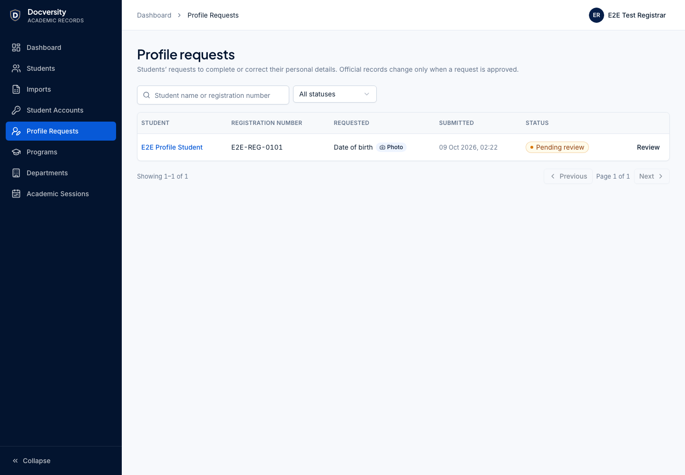                   | 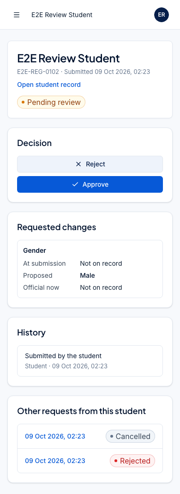 |
| 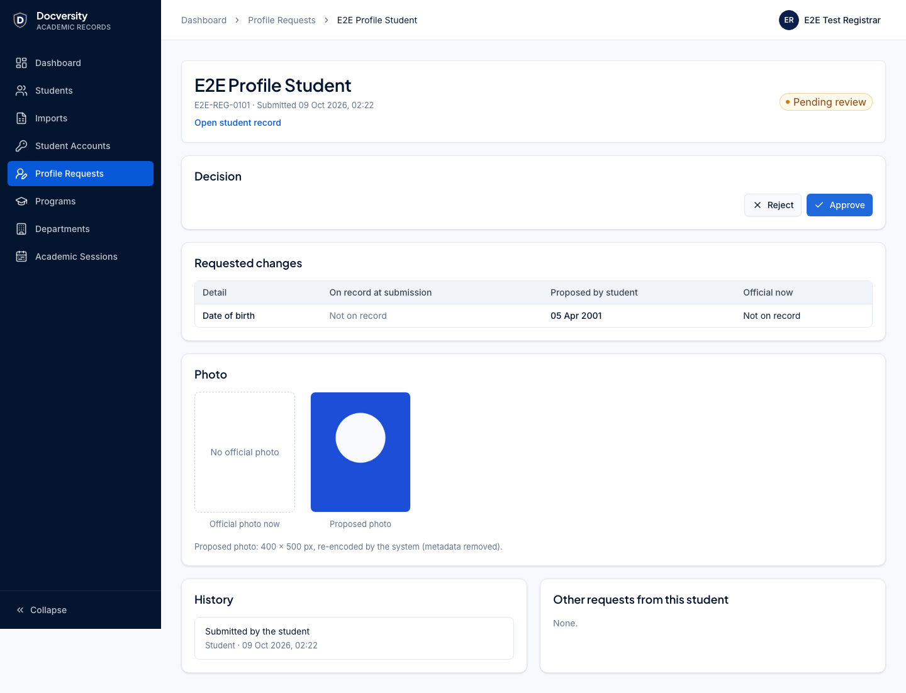            |                                                                  |
| 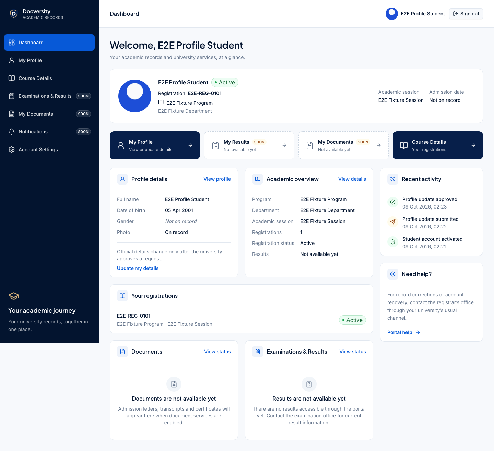 |                                                                  |

## Tests added

- API integration (`apps/api/test/student-profile`, 24): DOB submission, photo storage (re-encoded JPEG,
  EXIF removed, generated key), invalid images (text-as-JPEG, SVG, GIF, GIF-as-JPEG, too small), > 5 MB,
  empty/unchanged/invalid values, client-supplied identities, CSRF, ownership (404), staff/student route
  separation, one pending request (incl. concurrent submissions), cancellation, listing/filtering,
  comparison, RBAC (VIEWER, EXAM_ADMIN), approval (only requested fields), audit content (names only),
  rejection (mandatory reason, record unchanged), stale field and stale photo, concurrent decisions
  (exactly one wins), database guards, storage outage (503, nothing recorded), photo cleanup after a lost race.
- Web unit (`apps/web/test/profile-requests.test.tsx`, 9 + 1 updated): review step, only changed fields
  sent with the student CSRF token, validation, client photo checks, API field errors, request card
  (reason, cancel), admin comparison, reject reason required, stale approval blocked, no controls without
  the review permission.
- Playwright (`apps/web/e2e/student-profile.spec.ts`, 3): invalid image refused by the server → photo + DOB
  submitted → registrar approves → profile/photo/activity updated; rejection with reason seen by the
  student and cancellation; 390 px student form/review/history and staff queue/review without horizontal
  scrolling. axe (WCAG A/AA) runs on every new screen.

## Known limitations

- No partial approval: a request is approved or rejected as a whole; stale requests must be rejected and
  resubmitted.
- An existing date of birth is corrected by the registrar, not through a student request.
- Photos of rejected/cancelled requests stay in private storage (no retention job yet).
- No notifications (email/in-portal) when a request is decided; students check the requests page.
- The admin search box applies after a short debounce; navigating within that moment can be undone by
  the late URL update (existing behaviour of all admin list searches).
