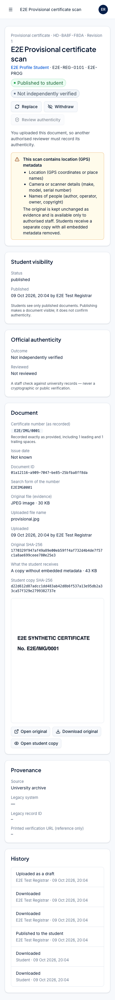
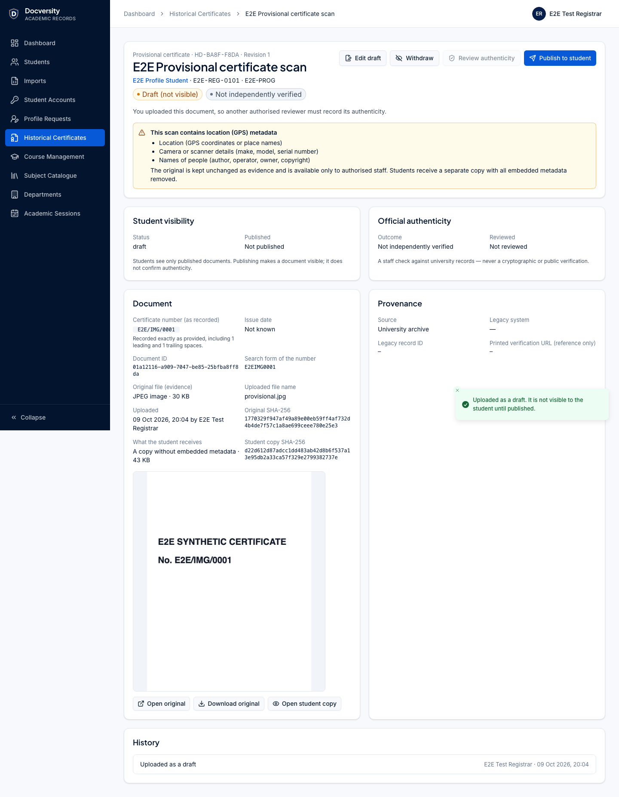
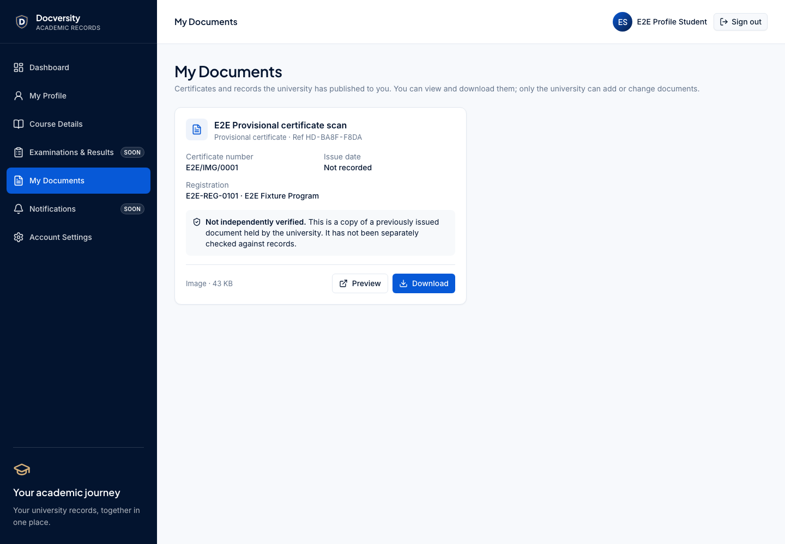

# Phase 8 — Historical certificates and the student document library (delivery report)

Branch `feature/phase-8-historical-certificates` from `main` at `df11f59`. API reference:
[docs/api/historical-documents.md](../api/historical-documents.md). Decision: [ADR-0013](../decisions/ADR-0013-historical-documents.md).

## Implemented

- **Staff** (`/admin/historical-documents`): register with search and status/type/authenticity filters;
  upload page (registration search, or preselected from a student record's **Upload document** button;
  type, title, certificate number, issue date, provenance, legacy identifiers, file); detail page with
  preview/download, separate **Student visibility** and **Official authenticity** panels, provenance and
  legacy identifiers (plain text), replacement chain, same-number warnings and full history; actions:
  edit draft, publish (confirmed), withdraw (reason), replace, review authenticity.
- **Students** (`/student/documents`, now enabled in the sidebar and dashboard): own published documents
  only, with plain-language authenticity, preview and download. No upload, edit, replace, delete or
  publish controls or routes exist.
- **Database**: additive migration `20261012090000_historical_documents` (one table, four enums, CHECKs,
  partial unique indexes, guard trigger). No existing table or row is changed.

## Requirement coverage

| #   | Requirement                                                          | Where                                                                                                  |
| --- | -------------------------------------------------------------------- | ------------------------------------------------------------------------------------------------------ |
| 1   | Only authorised staff upload                                         | `historicalDocuments.upload` (REGISTRAR, CERTIFICATE_ADMIN, SUPER_ADMIN); students have no write route |
| 2   | Linked to the right student and registration                         | required `studentRegistrationId`; replacement must stay on it (trigger); immutable                     |
| 3   | Secure PDF/JPEG/PNG upload, preview, download                        | content inspection, private storage, authenticated streaming with safe headers                         |
| 4   | Explicit publish                                                     | DRAFT is invisible; `publish` endpoint + confirmation                                                  |
| 5   | Students see only their own published documents                      | session-scoped queries, `PUBLISHED` filter, `404` otherwise                                            |
| 6   | Students cannot change documents                                     | no routes (verified `404` for POST/PATCH/DELETE attempts)                                              |
| 7   | Metadata, original numbers, issue dates, provenance                  | columns + UI; numbers kept exactly as provided (raw + normalised form since the hardening)             |
| 8   | Visibility ≠ authenticity                                            | separate status and authenticity fields, separate permissions, maker–checker                           |
| 9   | Auditable withdrawal/replacement, no deletion                        | reasons, supersession, trigger forbids DELETE, audit events                                            |
| 10  | No cross-student access, URL leaks, unsafe files, unauthorised staff | see security findings                                                                                  |
| 11  | Legacy identifiers preserved; WordPress/QR untouched                 | stored as given; `legacy_mappings` and legacy systems not modified                                     |
| 12  | Additive migrations, existing storage architecture                   | one new migration; `ObjectStorage` port, generated keys                                                |
| 13  | Design system                                                        | AdminShell/StudentShell, shared cards, badges, dialogs, data table                                     |
| 14  | Tests                                                                | below                                                                                                  |
| 15  | Safe migration on existing data                                      | row counts and ID hashes of 12 tables identical before/after on the development database               |
| 16  | Gates and CI                                                         | below                                                                                                  |

## Security findings (review during implementation)

- **Unsafe content.** Signature sniffing; declared type must match; PDFs with JavaScript, launch actions,
  embedded files, XFA/forms or media are refused, including names hidden in compressed object streams
  and `#xx`-escaped names (inflate budget 64 MB); encrypted PDFs refused; images fully decoded with a
  100 MP budget. _Residual risk:_ PDF viewers can still have parser bugs; files open only for
  authorised staff and their own student, with `nosniff` and a `default-src 'none'` CSP.
- **Object URL leaks.** Storage keys never leave the API; files are streamed through permission/ownership
  checks with `private, no-store` and generated file names.
- **Cross-student access.** Ownership and `PUBLISHED` are checked in the same query; other cases are `404`
  (no existence oracle). Tested with two students.
- **Maker–checker.** The uploader cannot review authenticity (API `403` + database CHECK).
- **Embedded image metadata:** fixed in the pre-merge hardening below (students receive a metadata-free
  copy; the original stays staff-only evidence). Retention of withdrawn/superseded files awaits a policy.

## Tests

- API: file inspection unit tests (9) and integration tests (24): upload/validation, unsafe files,
  duplicates, size limit, RBAC for every role and action, CSRF, students locked out of staff routes and
  without write routes, publication, ownership, download headers and audit, withdrawal, replacement and
  supersession, same-number warning, maker–checker review, concurrent publish, storage outage.
- Database: 5 guard tests (creation, immutability, transitions, replacement, authenticity CHECK, duplicates).
- Types: 2 role-mapping tests. Web: 8 component tests. Playwright: 3 scenarios (full lifecycle across
  staff, a second reviewer and two students; unsafe upload, viewer and student lockout; 390 px screens).
- Totals on the final run: **489 unit/integration tests** (types 16, validation 26, storage 3, imports 60,
  database 90, worker 7, web 57, api 230) and **31 Playwright tests**, all passing; axe (WCAG A/AA) on every
  new screen; no horizontal scrolling at 390 px.

## Pre-merge hardening (after manual acceptance)

Manual acceptance found three issues; all are fixed on this branch. Additive migration
`20261013090000_historical_document_hardening`.

1. **Image metadata reached students (high).** Student downloads of a JPEG scan carried GPS coordinates,
   a camera serial number and the scanner operator's name. Now every JPEG/PNG gets a separate **student
   copy** at upload: re-encoded from decoded pixels with `sharp` (orientation applied, sRGB, no resizing,
   JPEG q95 4:4:4, PNG lossless, DPI kept in JFIF/pHYs), verified at creation and **on every read**
   (SHA-256 + an allow-list of JPEG segments / PNG chunks). Both student endpoints (preview and download)
   serve only the copy; a missing copy is `409 DOCUMENT_NOT_READY`, a missing/altered one `503` — the
   original is never served instead. The database refuses to publish an image without a copy and freezes
   it once set. Originals are unchanged and staff-only (`?variant=original`, permission-checked);
   `?variant=student` shows staff exactly what the student gets. Staff see a warning with the **kinds**
   of metadata found (location, device, person, text, other) — values are never stored, logged or
   audited. Older rows: `pnpm documents:backfill-student-copies` (`--dry-run`; idempotent; reads
   originals only and refuses ones whose SHA-256 no longer matches; new objects only).
2. **Certificate numbers were trimmed.** Now stored exactly as provided; control and invisible
   formatting characters are refused (not removed). A separate `certificate_number_normalized` (NFKC,
   upper-case, letters/digits) drives search and the same-number warning. Staff see the exact value,
   with surrounding spaces made visible and stated, plus the search form. Rows created before the
   migration keep their (already trimmed) values; nothing existing was rewritten.
3. **Replacements were ambiguous.** Every document has a short reference (`HD-1B97-2390`) and a revision
   number; the detail page shows "This is an earlier version. Current version: Revision 2 · HD-…",
   a **Versions** list of the whole chain (revision, reference, title, number, status, dates; links named
   by revision and reference, never by title alone), and the document ID. List rows show the reference
   and a "Replacement" marker; the publish dialog names the version being superseded.

**Tests added:** 9 sanitiser unit tests (EXIF GPS/serial/operator/description/copyright, XMP, IPTC, COM,
PNG text/eXIf, orientation 6, 300 dpi, legibility ≥ 40 dB PSNR overall and ≥ 35 dB on the printed number,
PNG pixel-identical, allow-list rejections, undecodable input); 8 API integration tests (original
unchanged + copy for preview and download, staff variants and RBAC, missing/altered copy never falls back,
ownership/draft/withdrawn/superseded for image files, backfill dry-run/idempotency/altered-original,
"being prepared" state, raw/normalised numbers incl. full-width and bidi/control refusal, revision and
reference identity incl. a withdrawn replacement attempt); 3 database-rule tests; 6 web component tests;
1 Playwright scenario (EXIF-laden JPEG via the UI → location warning → publish → student preview and
download contain no EXIF and none of the embedded values; 390 px + axe). A mutation check (serving the
original to students) fails 4 of the new API tests.

**Totals (final uncached run):** 515 unit/integration tests (types 16, validation 26, storage 3, imports
60, database 93, worker 7, web 63, api 247) and 32 Playwright tests, all passing; `db:check` clean.

**Remaining limitations:** PDFs are delivered as uploaded — their document-information/XMP metadata and
images embedded inside them are not sanitised (see the API reference). JPEG student copies are re-encoded
once (visually lossless, not bit-identical; the bit-identical original is staff-only). 16-bit PNGs are reduced to 8 bits per channel in the copy (verified). Withdrawn/superseded originals and copies stay in storage until a retention
policy exists. `legacyRecordId` and `legacySourceSystem` are still trimmed of surrounding whitespace.

## Screenshots (synthetic E2E data)

| Desktop                                                                                   | Mobile (390 px)                                                                          |
| ----------------------------------------------------------------------------------------- | ---------------------------------------------------------------------------------------- |
|                                           |                                           |
|                                           |                                           |
|                               |                                           |
|                    |                                  |
|                   |  |
|                                  |                                                                                          |
|  |                                                                                          |
|        |                                                                                          |

## Not in this phase

Certificate generation, public/QR verification and legacy QR mapping, bulk migration of legacy
documents, results, notifications to students, retention jobs.
