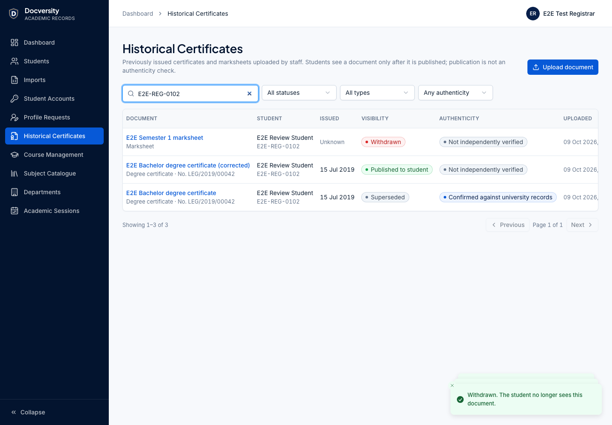
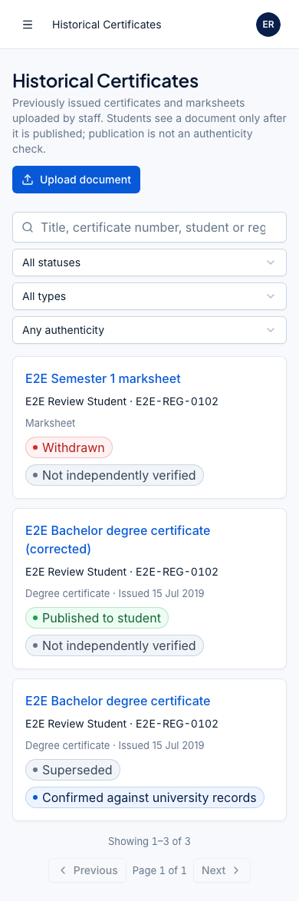
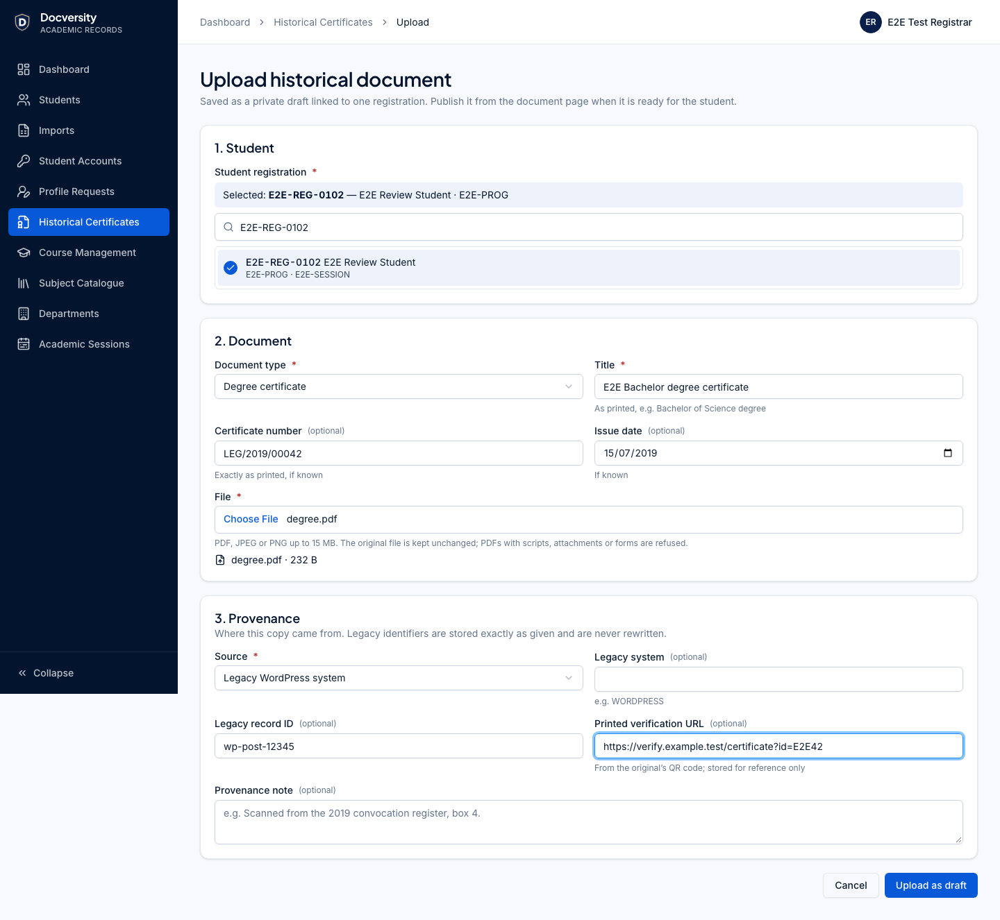
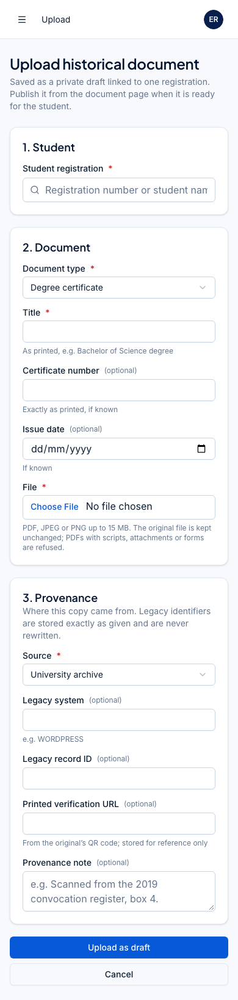
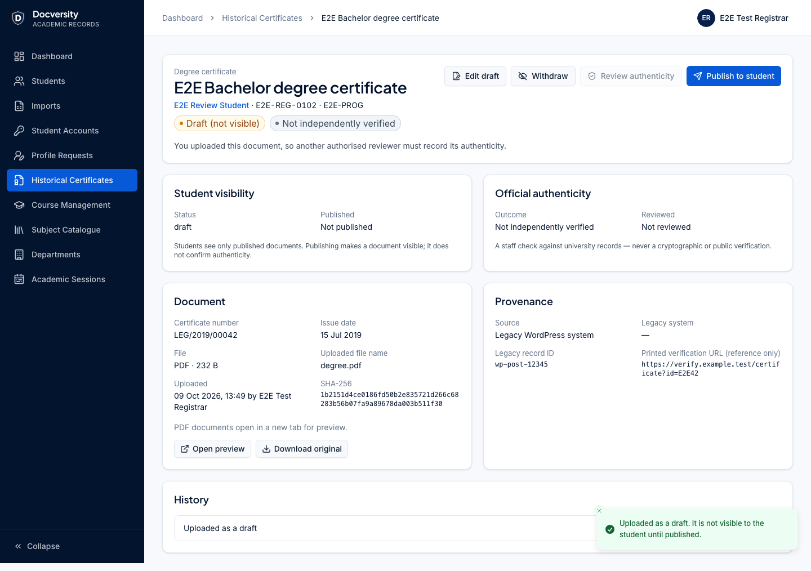
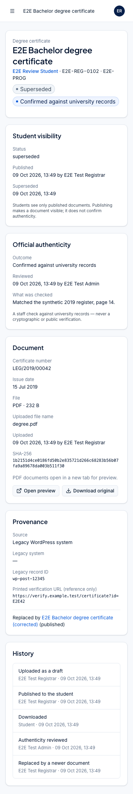
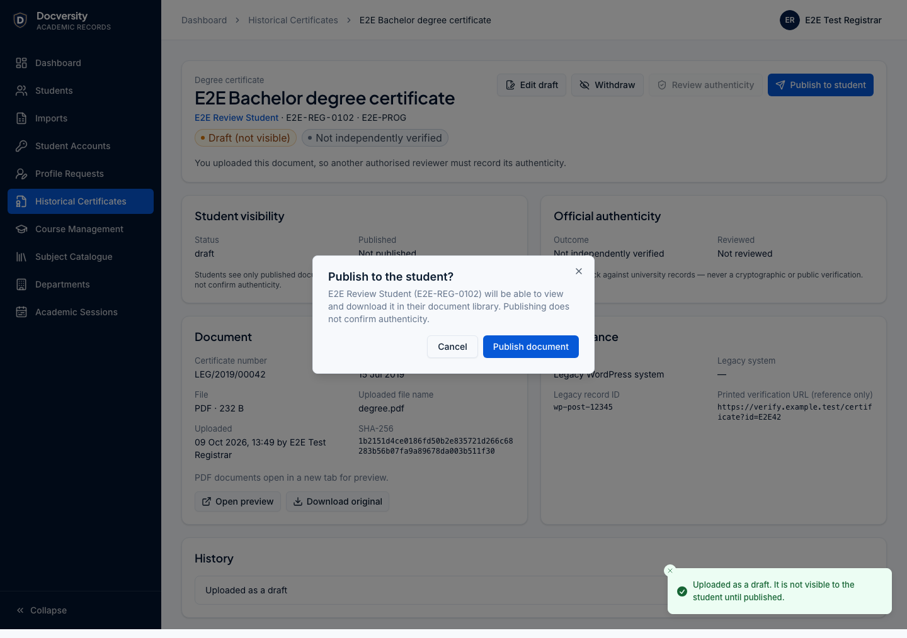
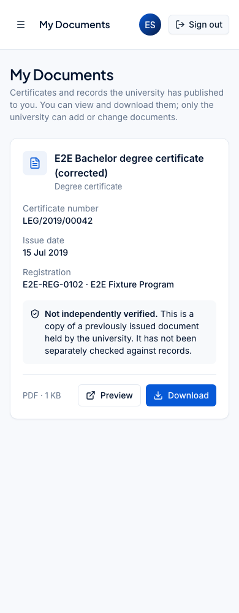
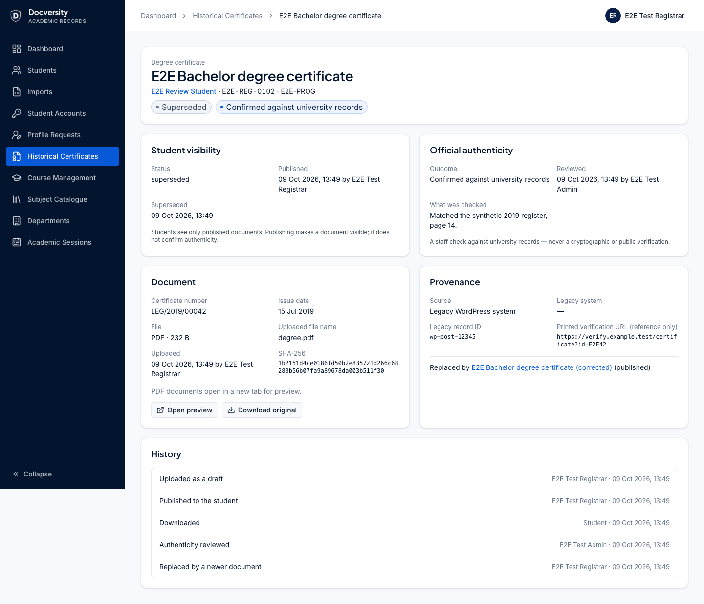
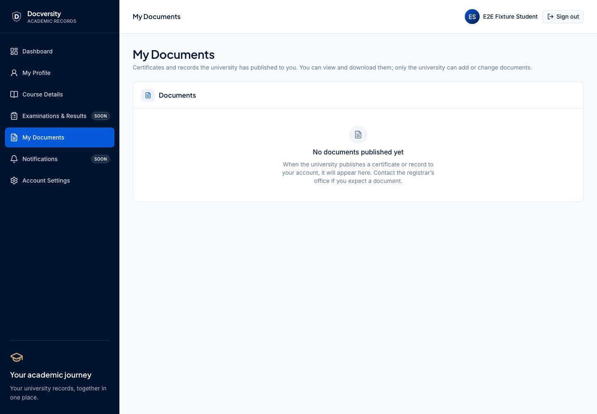

# Phase 8 — Historical certificates and the student document library (delivery report)

Branch `feature/phase-8-historical-certificates` from `main` at `df11f59`. API reference:
[docs/api/historical-documents.md](../api/historical-documents.md). Decision: [ADR-0013](../decisions/ADR-0013-historical-documents.md).

## Implemented

- **Staff** (`/admin/historical-documents`): register with search and status/type/authenticity filters;
  upload page (registration search, or preselected from a student record's **Upload document** button;
  type, title, certificate number, issue date, provenance, legacy identifiers, file); detail page with
  preview/download, separate **Student visibility** and **Official authenticity** panels, provenance and
  legacy identifiers (plain text), replacement chain, same-number warnings and full history; actions:
  edit draft, publish (confirmed), withdraw (reason), replace, review authenticity.
- **Students** (`/student/documents`, now enabled in the sidebar and dashboard): own published documents
  only, with plain-language authenticity, preview and download. No upload, edit, replace, delete or
  publish controls or routes exist.
- **Database**: additive migration `20261012090000_historical_documents` (one table, four enums, CHECKs,
  partial unique indexes, guard trigger). No existing table or row is changed.

## Requirement coverage

| #   | Requirement                                                          | Where                                                                                                  |
| --- | -------------------------------------------------------------------- | ------------------------------------------------------------------------------------------------------ |
| 1   | Only authorised staff upload                                         | `historicalDocuments.upload` (REGISTRAR, CERTIFICATE_ADMIN, SUPER_ADMIN); students have no write route |
| 2   | Linked to the right student and registration                         | required `studentRegistrationId`; replacement must stay on it (trigger); immutable                     |
| 3   | Secure PDF/JPEG/PNG upload, preview, download                        | content inspection, private storage, authenticated streaming with safe headers                         |
| 4   | Explicit publish                                                     | DRAFT is invisible; `publish` endpoint + confirmation                                                  |
| 5   | Students see only their own published documents                      | session-scoped queries, `PUBLISHED` filter, `404` otherwise                                            |
| 6   | Students cannot change documents                                     | no routes (verified `404` for POST/PATCH/DELETE attempts)                                              |
| 7   | Metadata, original numbers, issue dates, provenance                  | columns + UI; numbers kept exactly as printed                                                          |
| 8   | Visibility ≠ authenticity                                            | separate status and authenticity fields, separate permissions, maker–checker                           |
| 9   | Auditable withdrawal/replacement, no deletion                        | reasons, supersession, trigger forbids DELETE, audit events                                            |
| 10  | No cross-student access, URL leaks, unsafe files, unauthorised staff | see security findings                                                                                  |
| 11  | Legacy identifiers preserved; WordPress/QR untouched                 | stored as given; `legacy_mappings` and legacy systems not modified                                     |
| 12  | Additive migrations, existing storage architecture                   | one new migration; `ObjectStorage` port, generated keys                                                |
| 13  | Design system                                                        | AdminShell/StudentShell, shared cards, badges, dialogs, data table                                     |
| 14  | Tests                                                                | below                                                                                                  |
| 15  | Safe migration on existing data                                      | row counts and ID hashes of 12 tables identical before/after on the development database               |
| 16  | Gates and CI                                                         | below                                                                                                  |

## Security findings (review during implementation)

- **Unsafe content.** Signature sniffing; declared type must match; PDFs with JavaScript, launch actions,
  embedded files, XFA/forms or media are refused, including names hidden in compressed object streams
  and `#xx`-escaped names (inflate budget 64 MB); encrypted PDFs refused; images fully decoded with a
  100 MP budget. _Residual risk:_ PDF viewers can still have parser bugs; files open only for
  authorised staff and their own student, with `nosniff` and a `default-src 'none'` CSP.
- **Object URL leaks.** Storage keys never leave the API; files are streamed through permission/ownership
  checks with `private, no-store` and generated file names.
- **Cross-student access.** Ownership and `PUBLISHED` are checked in the same query; other cases are `404`
  (no existence oracle). Tested with two students.
- **Maker–checker.** The uploader cannot review authenticity (API `403` + database CHECK).
- **Not addressed (documented):** EXIF in image scans is preserved with the original file (evidence
  fidelity); retention of withdrawn/superseded files awaits a policy.

## Tests

- API: file inspection unit tests (9) and integration tests (24): upload/validation, unsafe files,
  duplicates, size limit, RBAC for every role and action, CSRF, students locked out of staff routes and
  without write routes, publication, ownership, download headers and audit, withdrawal, replacement and
  supersession, same-number warning, maker–checker review, concurrent publish, storage outage.
- Database: 5 guard tests (creation, immutability, transitions, replacement, authenticity CHECK, duplicates).
- Types: 2 role-mapping tests. Web: 8 component tests. Playwright: 3 scenarios (full lifecycle across
  staff, a second reviewer and two students; unsafe upload, viewer and student lockout; 390 px screens).
- Totals on the final run: **489 unit/integration tests** (types 16, validation 26, storage 3, imports 60,
  database 90, worker 7, web 57, api 230) and **31 Playwright tests**, all passing; axe (WCAG A/AA) on every
  new screen; no horizontal scrolling at 390 px.

## Screenshots (synthetic E2E data)

| Desktop                                                                  | Mobile (390 px)                                          |
| ------------------------------------------------------------------------ | -------------------------------------------------------- |
|                          |           |
|                          |           |
|              |           |
|   |  |
|  |                                                          |
|                 |                                                          |

## Not in this phase

Certificate generation, public/QR verification and legacy QR mapping, bulk migration of legacy
documents, results, notifications to students, retention jobs.
