# Phase 9 — External examinations, re-exam applications and regional QR payments (delivery report)

Baseline `main` at `ac7dc6d` (Phase 8 merge). **9A** examination application links and records
are committed in draft PR #5. **9B** re-exam applications, attempt tracking and fee rules are
implemented; delivery validation is recorded below. **9C** country/region payment settings, evidence and
staff verification are planned and have not been implemented. The supplied continuation brief
omits Parts C–G ("197 lines hidden"); the full payment requirements are needed before 9C implementation.
API: [docs/api/examinations.md](../api/examinations.md). Decision: [ADR-0014](../decisions/ADR-0014-examinations-and-re-exams.md).
Manual marks (Part F): [design only](../architecture/manual-marks-entry.md).

**Not built (by instruction):** online examinations, question banks, timers, proctoring, submissions,
evaluation, marks synchronisation, automatic exam notifications, grade/pass/GPA calculation, certificate
generation, public verification, deployment.

## Phase 9A — external examination application and examination records

- **Staff** `/admin/examinations` (records list, filters, create dialog: course → curriculum version →
  semester/year → session), `/admin/examinations/:id` (open, archive, accept/close re-exam applications,
  history), `/admin/examinations/application` (https-only links, instructions, active switch).
- **Students** `/student/examinations` (sidebar "Examinations"; "Results" stays a planned module): the
  examination application card (website, Android/iOS only when configured, instructions) with the plain
  statement that examinations happen outside Docversity and that downloading the app is not a
  registration; per own registration the assigned curriculum's semesters or years and its OPEN records;
  honest states when nothing is configured or no syllabus is assigned.
- **Database:** additive migration `20261014090000_examination_portal_foundation` — enum
  `ExaminationKind`, table `external_exam_applications` (https CHECK), `examinations.curriculum_id`
  (composite FK to the program's curricula), `kind`, `re_exam_applications_open` (re-exams only, CHECK),
  trigger `examinations_curriculum_guard` (period within the curriculum, no DRAFT curricula). Existing rows
  keep their values.
- **RBAC:** `examinations.read` (every staff role), `examinations.manage` (SUPER_ADMIN, EXAM_ADMIN).
- **Tests:** API 4 (https/unsafe URL refusal, RBAC, active-only student view, semester- and year-wise
  labels, period bounds incl. database trigger, draft curriculum refused, duplicate code, lifecycle and
  audit order, regular exams never accept applications, own-registration/OPEN-only student view,
  unassigned state, anonymous 401); types 1; web 4; Playwright 2 (configuration → record → student, with
  axe; 390 px screens).

## Phase 9B — re-exam applications, attempts and fee rules

- **Students** `/student/examinations/re-exam` (verified identity read-only; registration choice when
  several; open re-examinations of the own curriculum; subjects of that semester/year with the attempt and
  fee the server would record; honest states for no syllabus, inactive registration or nothing open) and
  `/student/examinations/re-exam/applications` (fee, decision with the university's reason, history,
  cancel while undecided, re-check an unconfigured fee).
- **Staff** `/admin/re-exam-applications` (search by name/registration number; filters status, course,
  batch, semester/year; CSV export), `/admin/re-exam-applications/:id` (identity snapshot, attempt + basis,
  fee snapshot and rule version, approve with note / reject with reason, history),
  `/admin/re-exam-applications/fees` (versioned fee rules; draft → activate → retire).
- **Fee schedule:** the confirmed amounts (attempt 1 INR 1,000, attempt 2 INR 2,500) are entered by an
  authorised user as a rule version with an explicit scope — nothing is seeded. The synthetic confirmed schedule leaves attempt 3+ unconfigured; payment cannot start without an approved rate.
- **Database:** additive migrations `20261015090000_re_exam_applications` and
  `20261015093000_re_exam_fee_snapshot_required_fields` (explicit non-null monetary snapshot checks;
  applied migrations unchanged). See docs/database/README.md.
- **RBAC:** `reExamApplications.read` (REGISTRAR, EXAM_ADMIN, APPROVER — not VIEWER), `.decide`
  (EXAM_ADMIN), `reExamFees.manage` (SUPER_ADMIN).
- **Tests:** API 8 (fee-rule RBAC/validation/freezing/versioning; identity prefill and own-curriculum
  options; client-supplied attempt/price/paid refused; duplicate 409; 1,000 → 2,500 → no third fee;
  rejected attempts not counted; NO_ACTIVE_RULE / SCOPE_NOT_SUPPORTED / re-check; no re-pricing; student
  isolation (404); unassigned registrations; cancel rules; read vs decide; concurrent decisions (200 + 409); concurrent submissions derive distinct attempts and refuse duplicates;
  reasons not in audit; CSV export incl. formula-injection and audit); validation 4 (exact money, fee-rule
  contract, references, URLs); types 1; web 6; Playwright 1 + mobile pages. Mutation check: forcing every
  attempt to 1 fails the attempt-history test.

## University-policy blockers (not invented)

| #   | Decision needed                                                                                                                       | Effect today                                                                                                                                                 |
| --- | ------------------------------------------------------------------------------------------------------------------------------------- | ------------------------------------------------------------------------------------------------------------------------------------------------------------ |
| P1  | Is the re-exam fee per paper (subject), per application, or per examination session?                                                  | Staff must choose a scope when activating a fee rule; per-session is refused until defined (9B)                                                              |
| P2  | How are re-exam attempts counted (all non-rejected applications? only approved and attended? per subject across curriculum versions?) | 9B counts earlier non-rejected, non-cancelled re-exam applications for the same registration and catalogue subject and stores that basis on each application |
| P3  | Fee for a third or later re-exam                                                                                                      | No amount: payment is blocked with "no approved fee for attempt 3"                                                                                           |
| P4  | Must payment be confirmed before a re-exam application is approved?                                                                   | Not enforced; staff see the payment state when deciding (9C)                                                                                                 |
| P5  | Amounts/currencies for Nepal, Bangladesh, Pakistan, Afghanistan, Europe, Central Asia, Others                                         | Only staff-entered amounts are used; no conversion is computed (9C)                                                                                          |
| P6  | Who verifies payments and who configures payment destinations (a finance role?)                                                       | APPROVER verifies; SUPER_ADMIN configures (proposal)                                                                                                         |
| P7  | Which subjects a student may apply for (only failed/absent ones?)                                                                     | Any subject of the chosen period; staff decide. Results are not in Docversity yet                                                                            |
| P8  | Grading, components and attempt mapping for manual marks                                                                              | Part F design only; Phase 10                                                                                                                                 |
| P9  | Refunds, waivers and partial payments                                                                                                 | Not supported                                                                                                                                                |

## Screenshots (synthetic E2E data)

| 9A desktop                                                              | 9A mobile (390 px)                                               |
| ----------------------------------------------------------------------- | ---------------------------------------------------------------- |
| 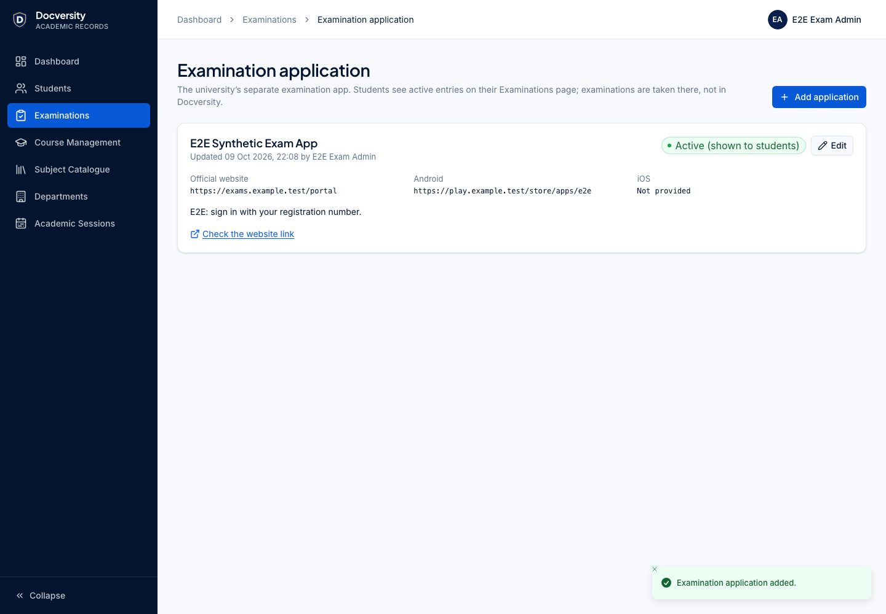 | 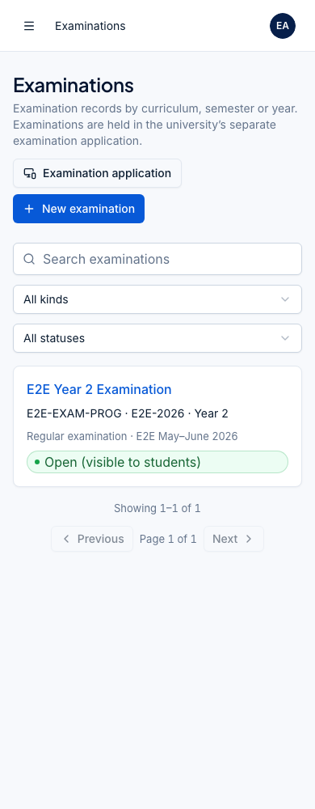       |
| 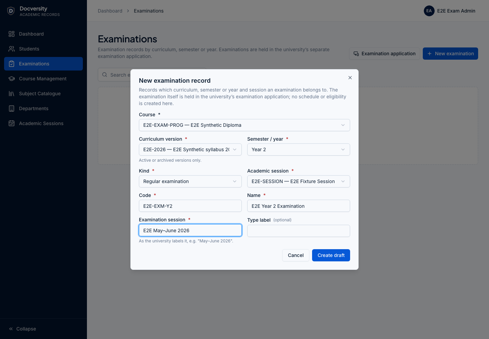       | 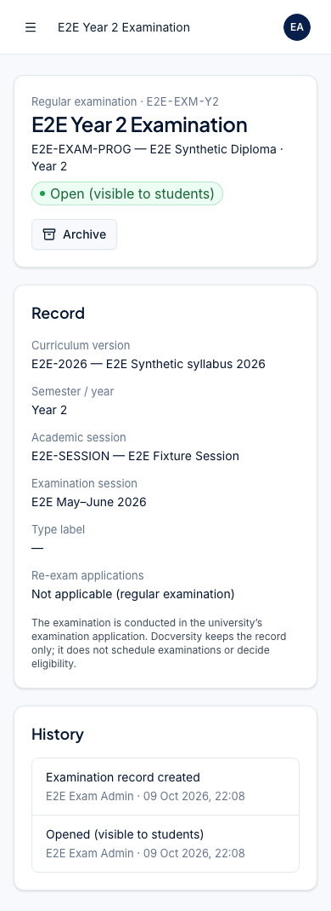     |
| 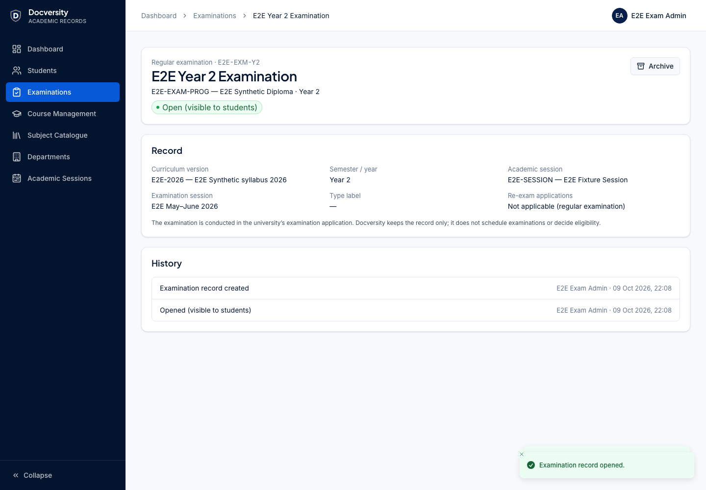           | 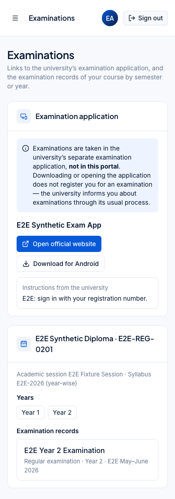 |
| 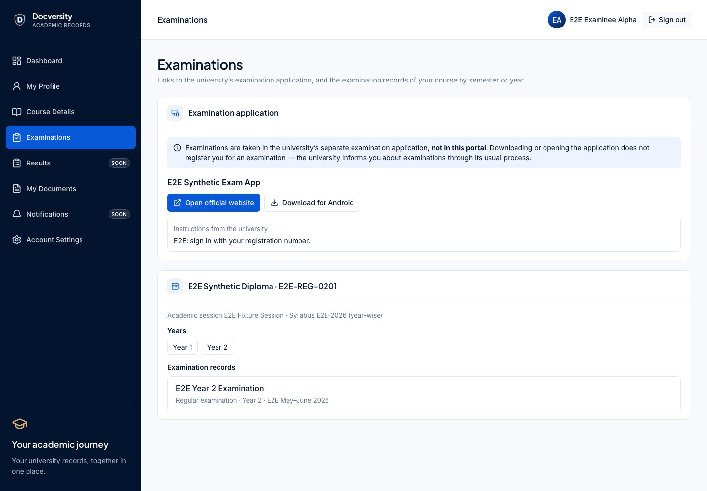       |                                                                  |

## Phase 9B continuation validation (2026-10-09)

- The existing branch retains the Phase 8 merge `ac7dc6d` as an ancestor and is stacked on 9A commit
  `aac2c19`; remote main was still at the requested Phase 8 baseline when checked.
- Formatting, lint, type checks, production build and database drift checks passed. Lint retains the
  existing TanStack Table React Compiler warning (zero errors).
- Full uncached package tests passed: **543 tests across 74 files**, including 259 API and 73 web tests.
  Command: `pnpm test --force -- --maxWorkers=2`. The first unrestricted run timed out in existing web
  tests under concurrent host load; no test assertions or timeouts were relaxed.
- The assessed-fee NULL regression verifies both missing currency and missing amount against the real
  hardening migration in the disposable API database. Concurrent submissions verify distinct server
  attempts and one `201` / one `409` for duplicates.
- All **35 browser tests passed**, including examination/re-exam workflows, mobile screens,
  accessibility, student ownership, curriculum, profile, document and import regressions.
  Browser validation used a temporary copy of the existing Playwright configuration with web/API ports
  3200/4200, a separate `_phase9_e2e` database and Redis/queue prefixes. The standard ports were occupied
  by another checkout. Only synthetic fixtures are used; no real payment QR exists in this scope.
- The local database was backed up (private archive plus SHA-256; archive listing verified) before
  applying the snapshot hardening migration. All 13 migrations are applied and `db:check` reports
  "No difference detected". Temporary browser-test configuration files were removed.
- **Payment implementation and CI:** 9C has not been implemented. Remote CI status is separate from
  these local checks and must be reported from the PR run. No merge or deployment is authorised.

The input attachment literally replaces Parts C–G with "197 lines hidden". Full country/region,
QR configuration, receipt, verification and university-policy requirements must be supplied before 9C.
The recorded attempt basis remains a proposal pending university confirmation; neither application
submission nor fee assessment constitutes an attended examination or a verified payment.

### Phase 9B screenshots (synthetic fixtures)

| Desktop                                                                          | Mobile (390 px)                                                                 |
| -------------------------------------------------------------------------------- | ------------------------------------------------------------------------------- |
| 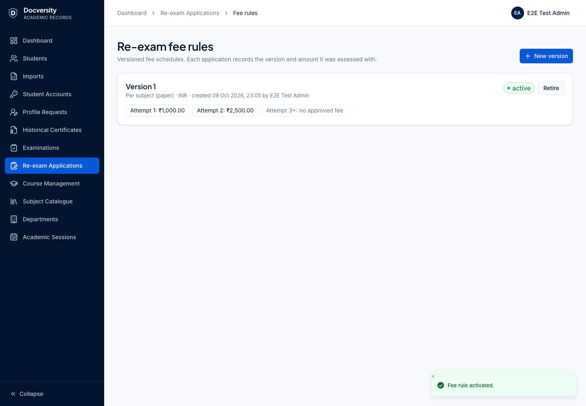                      | 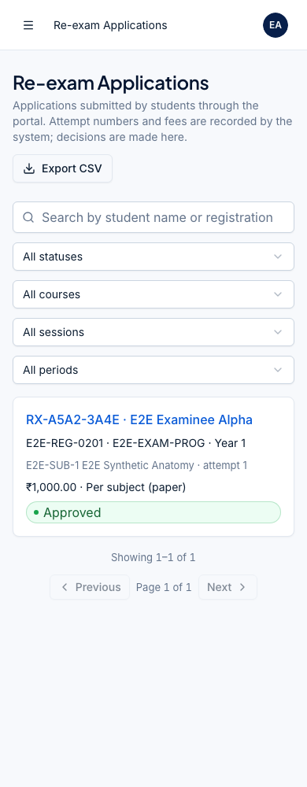                  |
| 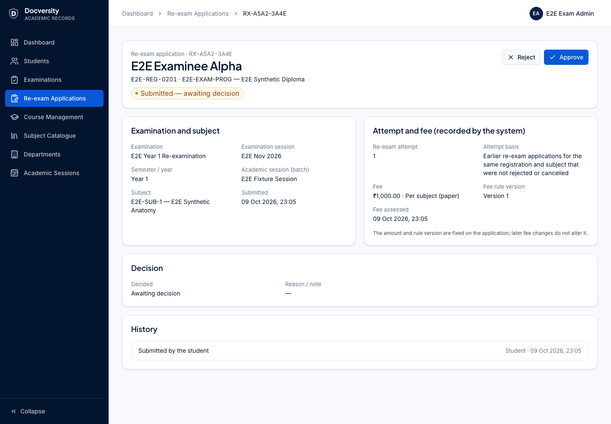            | 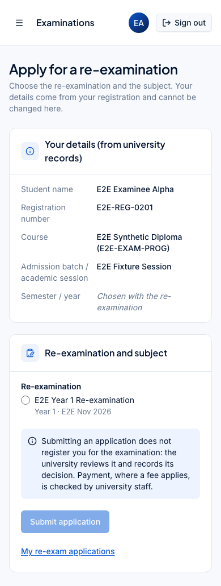           |
| 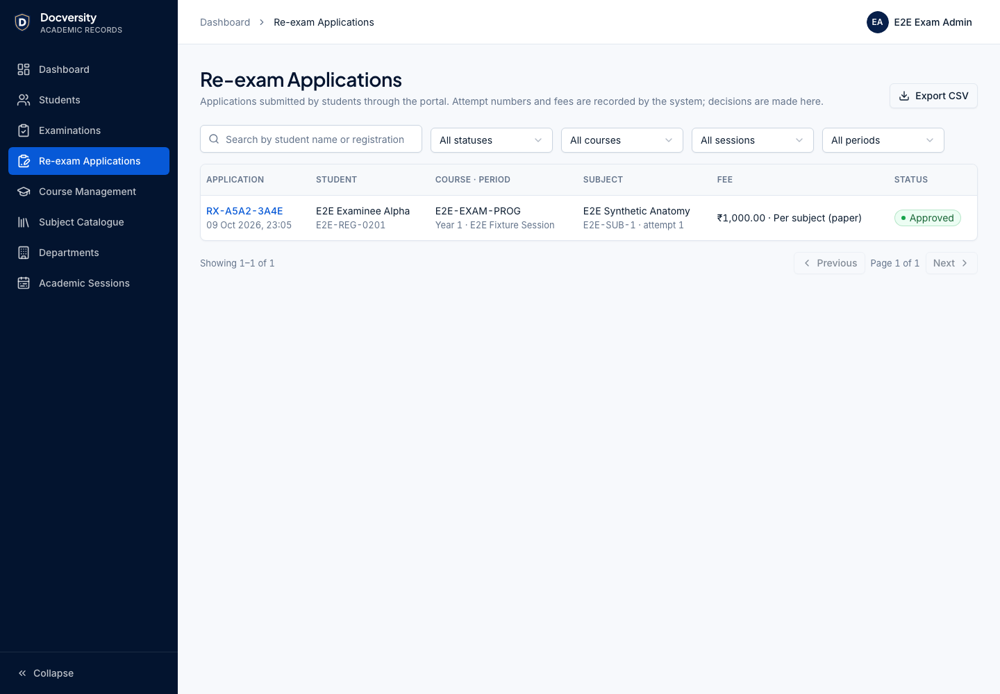              | 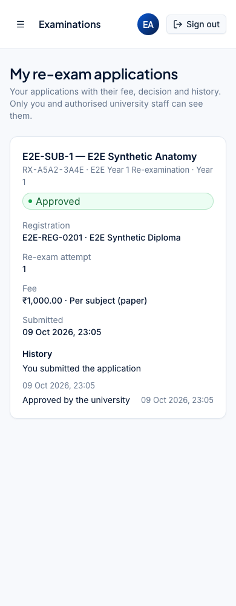 |
| 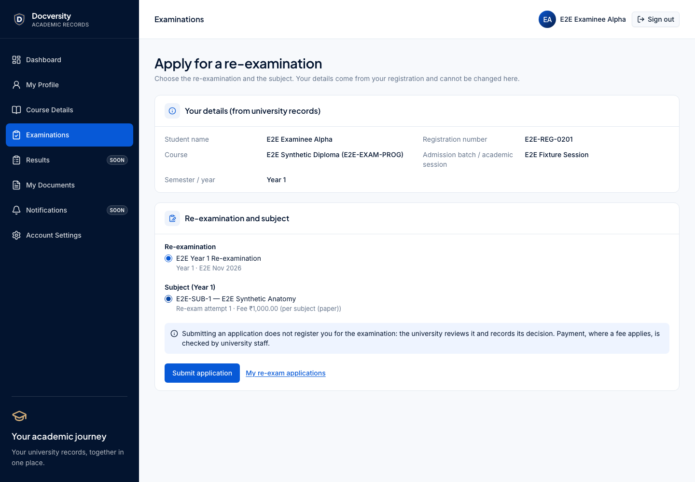           |                                                                                 |
| 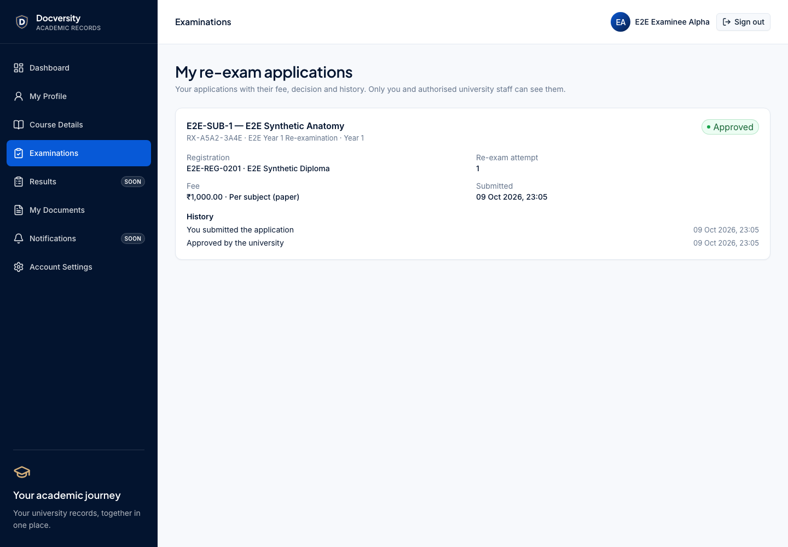 |                                                                                 |
