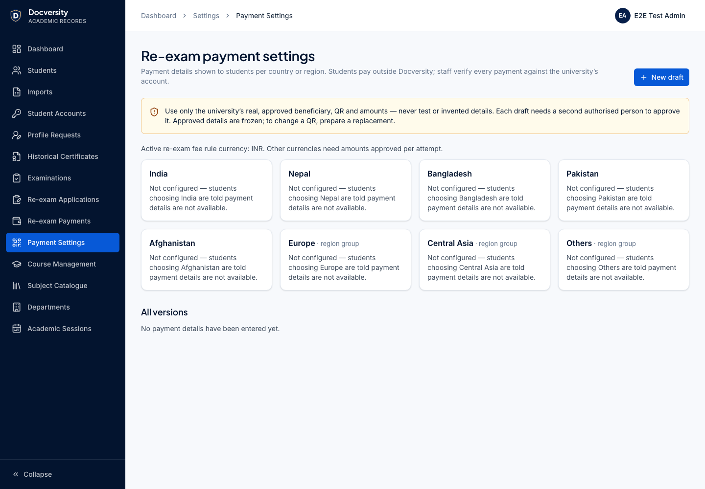
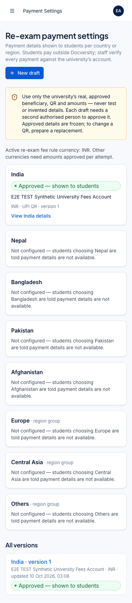
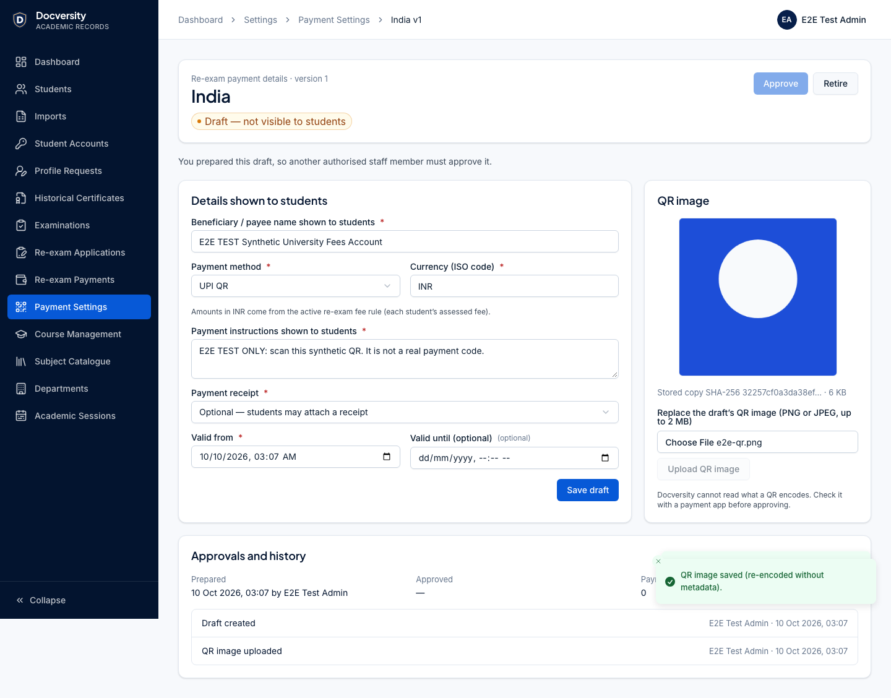
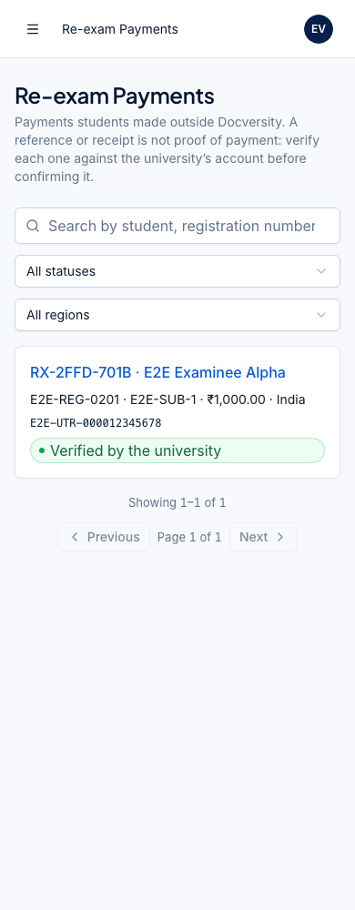
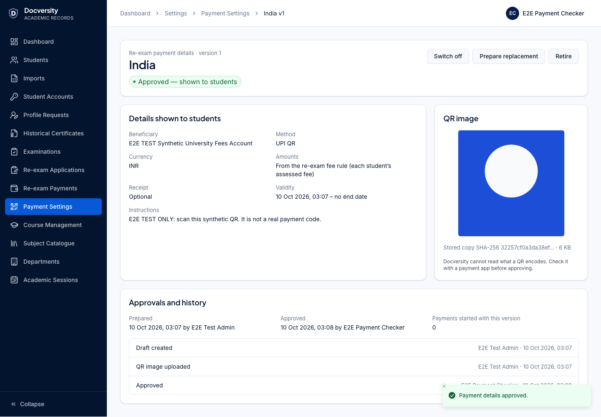
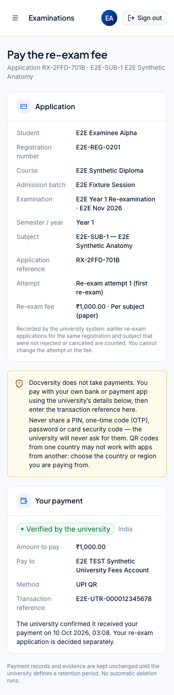
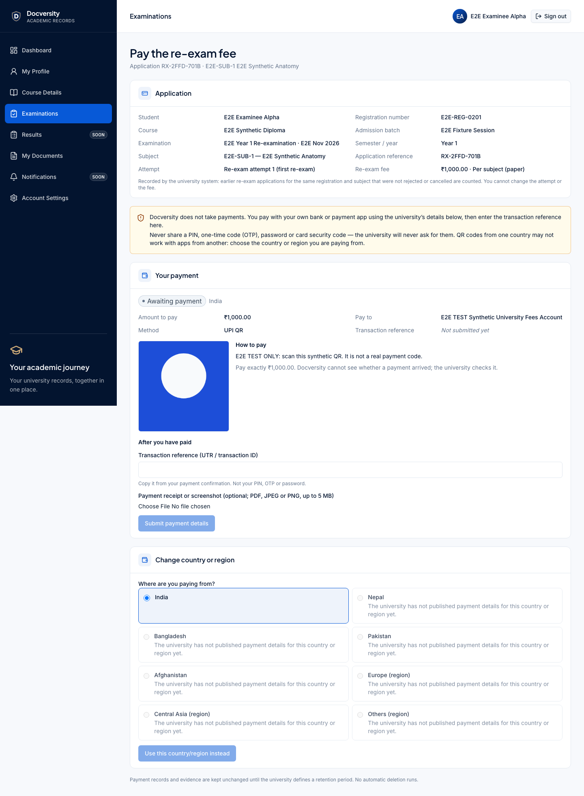
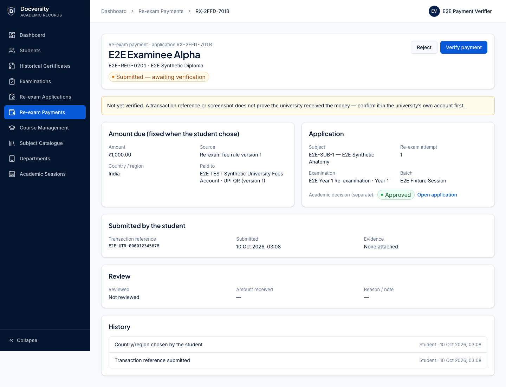

# Phase 9 — External examinations, re-exam applications and regional QR payments (delivery report)

Baseline for 9A/9B: `main` at `ac7dc6d` (Phase 8 merge). **9A** (PR #5) and **9B** (PR #7) are merged
into `main` (`baea394`). **9C** country/region payment settings, payment submission and staff verification
are implemented on `feature/phase-9c-reexam-payments` (see below).
API: [docs/api/examinations.md](../api/examinations.md). Decision: [ADR-0014](../decisions/ADR-0014-examinations-and-re-exams.md).
Manual marks (Part F): [design only](../architecture/manual-marks-entry.md).

**Not built (by instruction):** online examinations, question banks, timers, proctoring, submissions,
evaluation, marks synchronisation, automatic exam notifications, grade/pass/GPA calculation, certificate
generation, public verification, deployment.

## Phase 9A — external examination application and examination records

- **Staff** `/admin/examinations` (records list, filters, create dialog: course → curriculum version →
  semester/year → session), `/admin/examinations/:id` (open, archive, accept/close re-exam applications,
  history), `/admin/examinations/application` (https-only links, instructions, active switch).
- **Students** `/student/examinations` (sidebar "Examinations"; "Results" stays a planned module): the
  examination application card (website, Android/iOS only when configured, instructions) with the plain
  statement that examinations happen outside Docversity and that downloading the app is not a
  registration; per own registration the assigned curriculum's semesters or years and its OPEN records;
  honest states when nothing is configured or no syllabus is assigned.
- **Database:** additive migration `20261014090000_examination_portal_foundation` — enum
  `ExaminationKind`, table `external_exam_applications` (https CHECK), `examinations.curriculum_id`
  (composite FK to the program's curricula), `kind`, `re_exam_applications_open` (re-exams only, CHECK),
  trigger `examinations_curriculum_guard` (period within the curriculum, no DRAFT curricula). Existing rows
  keep their values.
- **RBAC:** `examinations.read` (every staff role), `examinations.manage` (SUPER_ADMIN, EXAM_ADMIN).
- **Tests:** API 4 (https/unsafe URL refusal, RBAC, active-only student view, semester- and year-wise
  labels, period bounds incl. database trigger, draft curriculum refused, duplicate code, lifecycle and
  audit order, regular exams never accept applications, own-registration/OPEN-only student view,
  unassigned state, anonymous 401); types 1; web 4; Playwright 2 (configuration → record → student, with
  axe; 390 px screens).

## Phase 9B — re-exam applications, attempts and fee rules

- **Students** `/student/examinations/re-exam` (verified identity read-only; registration choice when
  several; open re-examinations of the own curriculum; subjects of that semester/year with the attempt and
  fee the server would record; honest states for no syllabus, inactive registration or nothing open) and
  `/student/examinations/re-exam/applications` (fee, decision with the university's reason, history,
  cancel while undecided, re-check an unconfigured fee).
- **Staff** `/admin/re-exam-applications` (search by name/registration number; filters status, course,
  batch, semester/year; CSV export), `/admin/re-exam-applications/:id` (identity snapshot, attempt + basis,
  fee snapshot and rule version, approve with note / reject with reason, history),
  `/admin/re-exam-applications/fees` (versioned fee rules; draft → activate → retire).
- **Fee schedule:** the confirmed amounts (attempt 1 INR 1,000, attempt 2 INR 2,500) are entered by an
  authorised user as a rule version with an explicit scope — nothing is seeded. The synthetic confirmed schedule leaves attempt 3+ unconfigured; payment cannot start without an approved rate.
- **Database:** additive migrations `20261015090000_re_exam_applications` and
  `20261015093000_re_exam_fee_snapshot_required_fields` (explicit non-null monetary snapshot checks;
  applied migrations unchanged). See docs/database/README.md.
- **RBAC:** `reExamApplications.read` (REGISTRAR, EXAM_ADMIN, APPROVER — not VIEWER), `.decide`
  (EXAM_ADMIN), `reExamFees.manage` (SUPER_ADMIN).
- **Tests:** API 8 (fee-rule RBAC/validation/freezing/versioning; identity prefill and own-curriculum
  options; client-supplied attempt/price/paid refused; duplicate 409; 1,000 → 2,500 → no third fee;
  rejected attempts not counted; NO_ACTIVE_RULE / SCOPE_NOT_SUPPORTED / re-check; no re-pricing; student
  isolation (404); unassigned registrations; cancel rules; read vs decide; concurrent decisions (200 + 409); concurrent submissions derive distinct attempts and refuse duplicates;
  reasons not in audit; CSV export incl. formula-injection and audit); validation 4 (exact money, fee-rule
  contract, references, URLs); types 1; web 6; Playwright 1 + mobile pages. Mutation check: forcing every
  attempt to 1 fails the attempt-history test.

## Phase 9C — country/region re-exam payments, QR configuration and manual verification

Branch `feature/phase-9c-reexam-payments` from `main` `baea394` (9A + 9B + Phase 10A merged, CI green).

- **Staff — payment settings** `/admin/settings/re-exam-payments` (`reExamPayments.configure`,
  SUPER_ADMIN): overview of the eight choices (India, Nepal, Bangladesh, Pakistan, Afghanistan; region
  groups Europe, Central Asia, Others), versions per region, draft form (beneficiary, method, ISO currency,
  per-attempt amounts only for a currency other than the active fee rule's, instructions, receipt
  OPTIONAL/REQUIRED, validity, optional specific country for groups);
  `/admin/settings/re-exam-payments/[id]`: QR upload (stored re-encoded), approval by a **different**
  person (not the preparer or last editor) with an explicit confirmation, switch on/off, retire, "Prepare replacement" (new QR) — approving it
  retires the old version atomically.
- **Staff — review** `/admin/re-exam-payments` (`reExamPayments.read`, APPROVER): search by name,
  registration number, subject or transaction reference; filter status/region;
  `/admin/re-exam-payments/[id]`: fixed obligation (amount, source, fee-rule and destination versions),
  application with its separate academic decision, reference, protected evidence (every view audited),
  same-reference warnings, verify (amount + currency received + "checked the university's account") or
  reject with a reason (`reExamPayments.verify`).
- **Student** `/student/examinations/re-exam/[applicationId]/payment` ("Pay now" on each payable
  application): name, course, admission batch, examination and period, reference, attempt, fee; the eight
  choices with honest "not published" / "no approved amount" states; after choosing, only that
  destination's beneficiary, amount, instructions and QR; transaction reference (+ receipt if required);
  status, rejection reasons and earlier payments. PIN/OTP warnings; no fallback destination.
- **Application pages** (9B) show the latest payment for information only.
- **Database:** additive migration `20261016090000_re_exam_payments` (6 enums, 3 tables, CHECKs, 3 guard
  triggers) — see [docs/database/README.md](../database/README.md). The payments trigger re-derives every
  obligation's amount, so a client- or code-chosen amount, a conversion or an unapproved destination
  cannot be stored.
- **Lifecycle:** `AWAITING_PAYMENT → SUBMITTED → VERIFIED | REJECTED`; `AWAITING_PAYMENT → VOID` when the
  region is changed before paying. `NOT_CONFIGURED` is derived; `UNDER_REVIEW` is not needed (verification
  is one locked step). A rejected payment can be followed by a new one.
- **RBAC:** `reExamPayments.configure` (SUPER_ADMIN), `reExamPayments.read` and `.verify` (APPROVER,
  SUPER_ADMIN); application decisions stay `reExamApplications.decide` (EXAM_ADMIN).
- **Audit:** `RE_EXAM_PAYMENT_DESTINATION_CREATED/_UPDATED/_QR_UPLOADED/_APPROVED/_ACTIVATED/_DEACTIVATED/
_RETIRED`, `RE_EXAM_PAYMENT_STARTED/_VOIDED/_SUBMITTED/_VERIFIED/_REJECTED/_EVIDENCE_VIEWED` (no
  references, reasons or notes in metadata).
- **Rate limits:** choosing a region 30/h, submitting 10/h per student account (Redis, fails closed).

### Phase 9C verification (2026-10-10)

**Financial integrity** (API tests `apps/api/test/examinations/re-exam-payments.test.ts`):

- Amounts are server-authoritative: start/submit schemas are strict (an `amountMinor` field → `400`); the
  INR obligation equals the application's snapshotted fee (₹1,000 attempt 1, ₹2,500 attempt 2); NPR/PKR/EUR
  use only approved destination amounts; attempt 2 without an NPR amount → `409 NO_APPROVED_AMOUNT`; an
  unassessed (third-attempt) application cannot pay anywhere; a direct database insert with an invented
  amount is refused by the trigger.
- The region choice only selects the destination: switching India → Nepal voids the unpaid India
  obligation and creates Nepal's with its own approved amount; the QR served is byte-identical (SHA-256)
  to the chosen destination's stored QR; a voided obligation's QR is `404`.
- Old versions stay attached: after a replacement QR is approved, the earlier version is RETIRED and the
  started obligation still references it (`destinationId`, `destinationVersion`); its QR is withdrawn and
  choosing India again moves the student to the new version.
- Disabled and expired destinations: switching off and an elapsed `effectiveUntil` make the region
  "not configured", block new obligations and hide the QR.

**Staff controls:** RBAC matrix (configure / read / verify vs REGISTRAR, EXAM_ADMIN, APPROVER, VIEWER;
anonymous `401`; staff session refused on student routes); maker–checker (approval by the preparer or by whoever last edited the draft or its QR is `409`, also
database CHECKs — the last-editor rule was added in release review as migration
`20261016093000_re_exam_payment_destination_editor_check`; approval needs the confirmation and a QR); approved versions frozen (API `409`, database
trigger); verification needs `confirmedAgainstUniversityAccount: true` and the exact amount and currency
(999 INR or 1000 USD → `409`); two reviewers acting at once (verify + reject) → exactly one `200`, one
`409`; decisions final and payments undeletable in the database; transaction references never written to
the audit log.

**Separation:** verifying a payment leaves the application SUBMITTED; approving an application leaves its
payment AWAITING_PAYMENT; rejecting an application leaves its submitted payment unchanged and blocks new
payments for it. Students cannot see another student's payment page, QR or submission (`404`).

**Uploads:** a disguised executable (MZ header as `image/png`) and a PDF with a hidden compressed
JavaScript action are refused; image QR/receipts are stored re-encoded without metadata; tiny or non-image
QR files are refused; REQUIRED evidence is enforced; normalised duplicate references (`utr synth 0001 77`
vs `UTR-SYNTH-000177`) are refused across students; a reference freed by a rejection may be reused (staff
see the earlier rejected one).

**Migration on synthetic data:** a separate database `<db>_phase9c_verify` received the 13 earlier
migrations, the development seed and synthetic rows in `results`, `result_items`, `certificates`,
`historical_documents`, `re_exam_fee_rules`/`_rates`, `users` and `audit_logs`. All 33 existing tables were
fingerprinted (row count + MD5 of all rows), the 9C migration applied, and every fingerprint was
identical; `prisma migrate diff` reported "No difference detected". The local development database was
backed up first (custom-format dump + SHA-256, listing verified); after migrating, its examinations,
re-exam, results, certificate, document and registration tables were unchanged and it contains **zero**
payment destinations — every region stays "not configured" until real details are entered and approved.

**Object storage:** all 1,262 MinIO objects that existed before this work are present with identical
ETag and size; new objects are only synthetic test uploads under generated keys.

**Browser acceptance** (Playwright, synthetic data, desktop 1440 px and mobile 390 px, axe on every
step): SUPER_ADMIN configures India (8 regions shown "not configured" first; draft; synthetic QR uploaded;
own approval disabled) → a second SUPER_ADMIN approves with the confirmation → the student opens the
existing approved application, sees verified identity and "Re-exam attempt 1 (first re-exam)", Pakistan
disabled, chooses India, sees only India's QR and ₹1,000.00, submits a test reference → status "Submitted —
awaiting verification" → another student cannot load the page → APPROVER finds it by registration number,
sees "not yet verified", verifies 1000.00 INR after ticking the account check → the student sees
"confirmed it received your payment" → the application (already approved by EXAM_ADMIN in 9B) is unchanged
and shows the payment separately. Mobile: settings, payment list and student payment page without
horizontal scroll.

| Desktop                                                                   | Mobile (390 px)                                                |
| ------------------------------------------------------------------------- | -------------------------------------------------------------- |
|                  |        |
|            |           |
|  |  |
|            |                                                                |
|                |                                                                |

**Quality gates and totals:** `pnpm format:check`, `pnpm lint` (0 errors; the existing TanStack Table
React Compiler warning remains), `pnpm typecheck`, `pnpm build --force` and `pnpm db:check` ("No difference
detected") pass. `pnpm test --force`: **583 tests in 78 files** — API 269 (37 files; 9C adds 10 tests),
web 79 (6 new), database 93, imports 77, validation 35 (5 new), types 19 (1 new), worker 7, storage 4
(1 new). `pnpm test:e2e`: **37 / 37 passed** (2 new 9C tests: desktop flow and 390 px screens).

Release review (before merge): `graphify-out/` was restored to `main` (regenerate after merging); the
maker–checker rule was extended to the last editor (migration
`20261016093000_re_exam_payment_destination_editor_check`, API check, UI hint, regression test); the e2e
spec waits for list searches to apply before following a result. All gates and 37/37 browser tests were
re-run on the final code.

Local browser runs note: the login limiter counts sign-ins per IP for 15 minutes (100); one full run uses
40, so back-to-back local runs can exhaust it (CI starts with an empty Redis). Only the disposable
`dve2e:rl:*` keys were cleared between local runs.

## University-policy blockers (not invented)

| #   | Decision needed                                                                                                                             | Effect today                                                                                                                                                     |
| --- | ------------------------------------------------------------------------------------------------------------------------------------------- | ---------------------------------------------------------------------------------------------------------------------------------------------------------------- |
| P1  | Is the re-exam fee per paper (subject), per application, or per examination session?                                                        | Staff must choose a scope when activating a fee rule; per-session is refused until defined (9B)                                                                  |
| P2  | How are re-exam attempts counted (all non-rejected applications? only approved and attended? per subject across curriculum versions?)       | 9B counts earlier non-rejected, non-cancelled re-exam applications for the same registration and catalogue subject and stores that basis on each application     |
| P3  | Fee for a third or later re-exam                                                                                                            | No amount: payment is blocked with "no approved fee for attempt 3"                                                                                               |
| P4  | Must payment be confirmed before a re-exam application is approved?                                                                         | Not enforced; staff see the payment state on the application (9C). Payment and decision never change each other                                                  |
| P5  | Amounts/currencies for Nepal, Bangladesh, Pakistan, Afghanistan, Europe, Central Asia, Others; do INR fees apply to international students? | Only explicitly approved per-attempt amounts of a destination are used for other currencies; an INR destination charges the assessed INR fee; no conversion (9C) |
| P6  | Who verifies payments and who configures payment destinations (a finance role?)                                                             | APPROVER verifies; SUPER_ADMIN configures and a second SUPER_ADMIN approves (proposal)                                                                           |
| P7  | Which subjects a student may apply for (only failed/absent ones?)                                                                           | Any subject of the chosen period; staff decide. Results are not in Docversity yet                                                                                |
| P8  | Grading, components and attempt mapping for manual marks                                                                                    | Part F design only; Phase 10                                                                                                                                     |
| P9  | Refunds, waivers, partial payments, one transaction paying several applications                                                             | Not supported: verification needs the exact amount and currency; a reference backs one live payment; otherwise reject with a reason                              |
| P10 | Real beneficiary accounts, QR images and instructions per country/region                                                                    | None supplied: every region is "not configured" until staff enter and a second person approves real details                                                      |
| P11 | Which payment evidence is required (receipt? screenshot? reference only?)                                                                   | Configurable per destination (`OPTIONAL` / `REQUIRED`); a reference is always required                                                                           |
| P12 | Retention of payment records and evidence                                                                                                   | Placeholder: kept unchanged, nothing deleted (`RE_EXAM_PAYMENT_RETENTION`)                                                                                       |

## Screenshots (synthetic E2E data)

| 9A desktop                                                              | 9A mobile (390 px)                                               |
| ----------------------------------------------------------------------- | ---------------------------------------------------------------- |
|  |        |
|        |      |
|            |  |
|        |                                                                  |

## Phase 9B continuation validation (2026-10-09)

- The existing branch retains the Phase 8 merge `ac7dc6d` as an ancestor and is stacked on 9A commit
  `aac2c19`; remote main was still at the requested Phase 8 baseline when checked.
- Formatting, lint, type checks, production build and database drift checks passed. Lint retains the
  existing TanStack Table React Compiler warning (zero errors).
- Full uncached package tests passed: **543 tests across 74 files**, including 259 API and 73 web tests.
  Command: `pnpm test --force -- --maxWorkers=2`. The first unrestricted run timed out in existing web
  tests under concurrent host load; no test assertions or timeouts were relaxed.
- The assessed-fee NULL regression verifies both missing currency and missing amount against the real
  hardening migration in the disposable API database. Concurrent submissions verify distinct server
  attempts and one `201` / one `409` for duplicates.
- All **35 browser tests passed**, including examination/re-exam workflows, mobile screens,
  accessibility, student ownership, curriculum, profile, document and import regressions.
  Browser validation used a temporary copy of the existing Playwright configuration with web/API ports
  3200/4200, a separate `_phase9_e2e` database and Redis/queue prefixes. The standard ports were occupied
  by another checkout. Only synthetic fixtures are used; no real payment QR exists in this scope.
- The local database was backed up (private archive plus SHA-256; archive listing verified) before
  applying the snapshot hardening migration. All 13 migrations are applied and `db:check` reports
  "No difference detected". Temporary browser-test configuration files were removed.
- **Payment implementation and CI:** 9C has not been implemented. Remote CI status is separate from
  these local checks and must be reported from the PR run. No merge or deployment is authorised.

The input attachment literally replaces Parts C–G with "197 lines hidden". Full country/region,
QR configuration, receipt, verification and university-policy requirements must be supplied before 9C.
The recorded attempt basis remains a proposal pending university confirmation; neither application
submission nor fee assessment constitutes an attended examination or a verified payment.

### Phase 9B screenshots (synthetic fixtures)

| Desktop                                                                          | Mobile (390 px)                                                                 |
| -------------------------------------------------------------------------------- | ------------------------------------------------------------------------------- |
|                       |                   |
|             |            |
|               |  |
|            |                                                                                 |
|  |                                                                                 |
